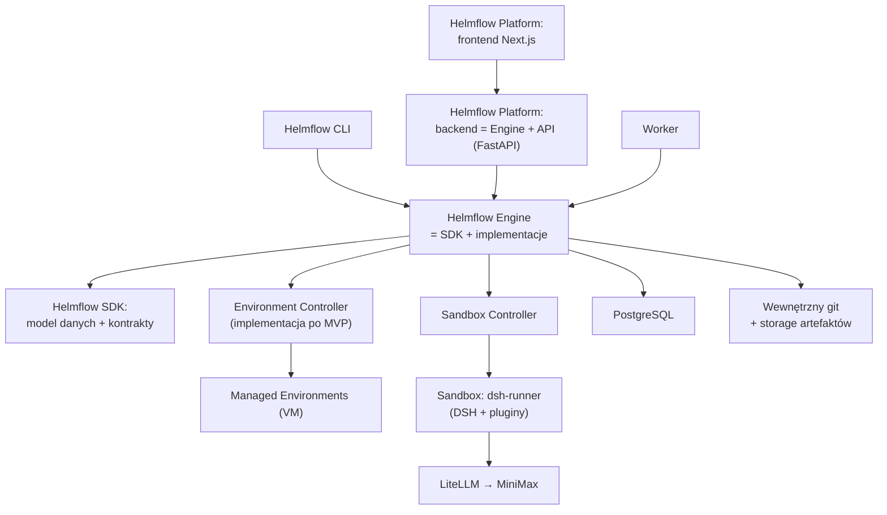

# Helmflow — architektura warstw i odpowiedzialności

Część dokumentacji produktowej Helmflow, wersja zestawu 0.9 (2026-09-06). Indeks: [README](README.md).

Rozdział porządkuje elementy systemu w kolejności warstw z [D3](decyzje.md). Zależności płyną wyłącznie w dół; żadna warstwa nie zna warstw powyżej siebie. Szczegóły poszczególnych produktów: [sdk](sdk.md), [engine](engine.md), [cli](cli.md), [platforma-web](platforma-web.md).

## 1. Helmflow SDK

Fundament: jednolity model danych i kontrakty części składowych. Nie zawiera implementacji, operacji wejścia/wyjścia ani logiki procesowej; egzekwuje wyłącznie niezmienniki jednoobiektowe. Pełny opis produktu: [sdk](sdk.md).

## 2. Helmflow Engine (silnik)

Implementuje całość logiki biznesowej produktu na kontraktach SDK — dziewięć obszarów od katalogu agentów po trwałość audytu. Kontrakt silnika (operacje asynchroniczne, streaming zdarzeń, cancel, resume) jest jedynym programistycznym wejściem warstw wyższych. Pełny opis produktu: [engine](engine.md).

## 3. Sandbox Controller

Osobny proces implementujący kontrakt sandboxa z SDK; jedyny komponent z dostępem do mechanizmu kontenerowego. Silnik komunikuje się z kontrolerem lokalnym kanałem technicznym (gniazdo Unix z uwierzytelnieniem systemowym) — nie jest to domenowe HTTP w rozumieniu [D3](decyzje.md). Odpowiada za cykl życia środowisk (tworzenie, start, stop, inspekcja, usunięcie), limity zasobów, izolację (rootless, brak socketu kontenerowego w kontenerze, read-only root) oraz proxy egress jako jedyną trasę wyjściową ([D7.4](decyzje.md)). Nie zawiera logiki biznesowej.

## 4. Helmflow Platform — backend (Engine + API)

Cienki host FastAPI osadzający silnik in-process. Mapuje kontrakt silnika na HTTP i SSE, obsługuje uwierzytelnienie ([D6.3](decyzje.md)) i sesje przeglądarki. Jedyne domenowe HTTP w systemie. Zero własnych reguł domenowych. Szczegóły: [platforma-web](platforma-web.md).

## 5. Helmflow Platform — frontend (Next.js)

Aplikacja Next.js serwująca wyłącznie interfejs użytkownika. Wywołania domenowe i strumień zdarzeń kierowane bezpośrednio do backendu; API routes Next.js nie zawierają logiki domenowej. Realizacja odroczona po TUI ([D9.3](decyzje.md)). Szczegóły: [platforma-web](platforma-web.md).

## 6. Helmflow CLI

Interfejs terminalowy osadzający Engine in-process; realizuje te same przypadki użycia co platforma bez osobnej logiki biznesowej i bez wymogu uruchomionego backendu. Wykonanie zawsze należy do workera — TUI jest obserwatorem i zleceniodawcą; zamknięcie TUI nie przerywa aktywnych Agent Runs. Szczegóły: [cli](cli.md).

## 7. Komponenty wykonawcze

- **Obraz `dsh-runner`** — przypięty po digest; zawiera DSH, jego Python SDK i pluginy profilu `helmflow-standard` (wstrzyknięcie kontekstu, eksport zdarzeń, raportowanie Change Rationale i Handoff). Działa wyłącznie wewnątrz sandboxa.
- **LiteLLM** — brama modelowa; jedyny posiadacz głównego klucza MiniMax; wydaje poświadczenia ograniczone do pojedynczego uruchomienia.
- **Wewnętrzny git i storage artefaktów** — implementacje kontraktów SDK utrzymywane przez silnik poza zasięgiem sandboxów ([D4](decyzje.md)).

## 8. Environment Controller (kontrakt w MVP, implementacja po MVP)

Odpowiednik Sandbox Controllera dla Managed Environments: jedyny komponent z dostępem do hipernadzorcy (VirtualBox/libvirt). Implementuje kontrakt środowisk z SDK: utworzenie maszyny, nienadzorowana instalacja systemu, snapshot i przywrócenie (Environment Snapshot), wgranie kodu z repozytorium lub Project Version, wykonanie poleceń, zebranie wyników jako Verification Evidence. Agent otrzymuje wyłącznie zakresowe poświadczenie do operacji na przypisanym środowisku — nigdy dostęp do hosta. Operacje destrukcyjne na środowiskach wymagają potwierdzenia właściciela.

## 9. Workspace Tracker

Składnik silnika działający po stronie hosta, poza sandboxem. Obserwuje workspace Agent Run przez wolumen montowany do sandboxa (zapis dla agenta, odczyt dla trackera), rejestruje File Change Events (skan po zdarzeniach narzędzi, skan okresowy, debounce) i utrwala File Versions przy checkpointach. Agent nie ma dostępu do procesu trackera ani jego zapisów. Źródłem prawdy o zmianach pozostaje końcowa rekonsyliacja ([D6.5](decyzje.md)); w MVP-0 dopuszczalna jest sama rekonsyliacja końcowa bez strumienia FCE.

## 10. Granice zaufania

| Strefa | Co w niej działa | Czego nie widzi |
|---|---|---|
| **Sandbox Agent Run** | DSH + jego SDK, pluginy `helmflow-standard`, kod projektu (workspace), Harness home | hosta, innych sandboxów, storage'u audytowego, głównego klucza MiniMax, socketu kontenerowego, procesu Workspace Trackera; sieć wyłącznie przez proxy egress ([D7.4](decyzje.md)) |
| **Host: silnik, worker, backend, CLI, Workspace Tracker** | logika biznesowa, magazyny stanu, ingest zdarzeń (trasa uwierzytelniona poświadczeniem per Agent Run) | — (strefa zaufana instalacji) |
| **Sandbox Controller** | jedyny posiadacz dostępu do mechanizmu kontenerowego | logiki biznesowej |
| **Environment Controller** (po MVP) | jedyny posiadacz dostępu do hipernadzorcy | logiki biznesowej |
| **Managed Environment** (po MVP) | badana/testowana platforma | hosta i pozostałych stref; sterowana wyłącznie przez Environment Controller |
| **Usługi zewnętrzne** (MiniMax) | generowanie w pętli agenta | wszystkiego poza wysłanym kontekstem ([produkt, rozdz. 3](produkt.md)) |

## 11. Pochodzenie funkcji: DSH kontra Helmflow kontra pozostałe

**Zależności Helmflow SDK** — celowo minimalne: [sdk](sdk.md).

| Funkcja | Dostarcza | Rola Helmflow |
|---|---|---|
| Pętla agenta: model ↔ narzędzia (edycja plików, wykonywanie poleceń), plan pracy | **DSH** | konfiguruje przez profil `helmflow-standard` i obserwuje |
| Sesja agenta i resume (`session_id`) | **DSH** | zarządza cyklem życia Attemptów i zgodnością wersji runtime |
| Trajectory append-only (log JSONL) | **DSH** | eksportuje pluginem, ingestuje idempotentnie, redaguje sekrety, prezentuje |
| Mechanizm pluginów (Cordis): wstrzyknięcie kontekstu, eksport zdarzeń, narzędzia Change Rationale i Handoff | **DSH** (mechanizm) + **Helmflow** (pluginy) | pluginy `dsh-helmflow` są kodem produktu |
| Połączenie z modelem (endpoint zgodny z OpenAI) | **DSH** (klient) + **LiteLLM** (brama) | wydaje poświadczenia per uruchomienie, egzekwuje budżety |
| Generowanie decyzji i treści w pętli agenta | **MiniMax** (przez LiteLLM) | wymienny bez zmian produktu |
| Model domeny, kontrakty, schematy, niezmienniki jednoobiektowe | **Helmflow SDK** | — |
| Katalog agentów, wersjonowanie, forki, promocje; wiedza i manifesty | **Helmflow Engine** | — |
| SDLC Flow, Stage/Agent Runs, stany, limity pętli, budżety, Blocked | **Helmflow Engine** | — |
| Project Versions, łańcuch wersji, handoffy | **Helmflow Engine** + wewnętrzny git ([D4](decyzje.md)) | — |
| Izolacja wykonania: sandbox per Agent Run, limity, proxy egress | **Sandbox Controller** + Podman/Docker | jedyny właściciel mechanizmu kontenerowego |
| File Change Events, File Versions, checkpointy, rekonsyliacja, diffy per agent/etap/plik/projekt, atrybucja | **Workspace Tracker** (silnik) | niezależne od `.git` agenta i od trajectory |
| Change Sets, Deliverables, review, decyzje, kontrolowana integracja | **Helmflow Engine** | agent nigdy nie zatwierdza własnej pracy |
| Trwały stan, kolejka pracy, zdarzenia na żywo | **PostgreSQL** | koordynacja procesów ([D3](decyzje.md)) |
| Interfejsy: TUI, backend API, headless | **Helmflow CLI / Platform** | na kontrakcie silnika |
| Managed Environments (po MVP) | **Environment Controller** + VirtualBox/libvirt | kontrakt w SDK od MVP |

Granica jest jednoznaczna: funkcje DSH wchodzą do produktu wyłącznie przez `runtime-dsh` implementujące kontrakt SDK. Helmflow świadomie **nie deleguje do DSH**: definicji i wersji agenta, manifestu wiedzy, stanu projektu i jego wersji, dowodów wykonania, decyzji review ani historii audytowej — nawet tam, gdzie DSH oferuje zbliżone możliwości.
