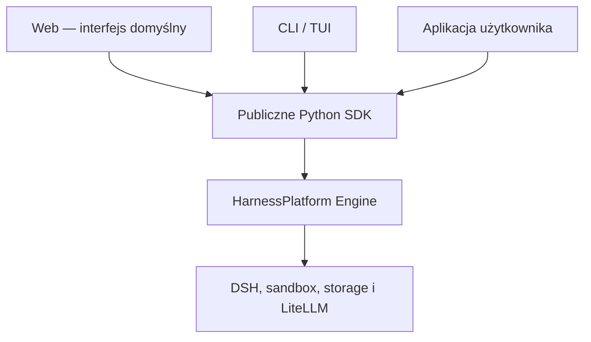
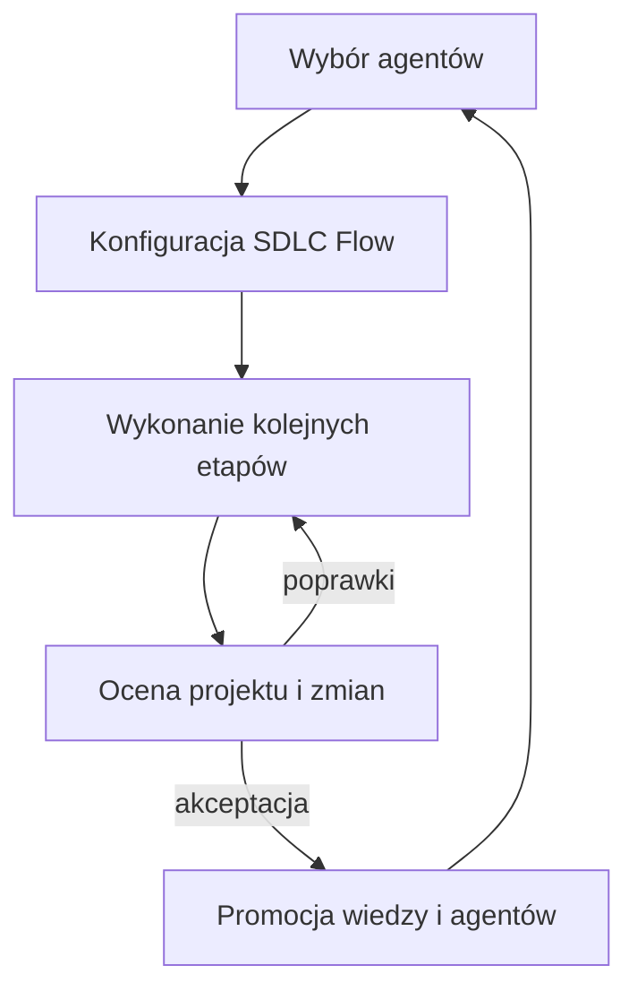
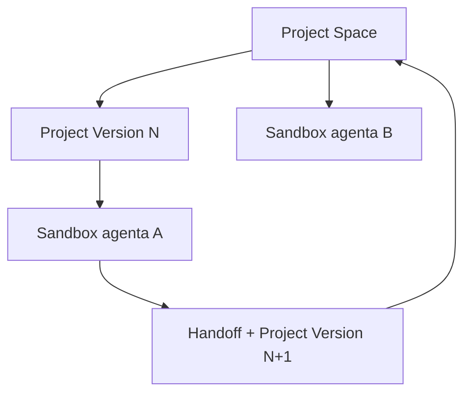
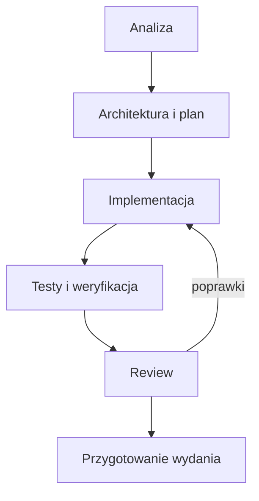
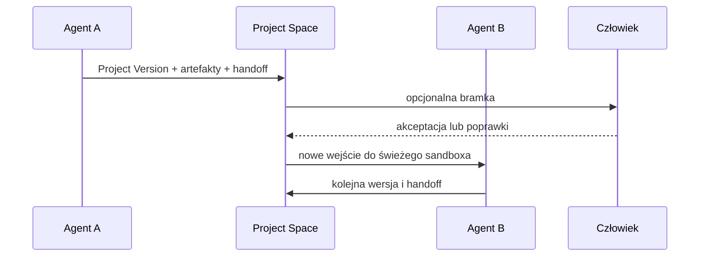
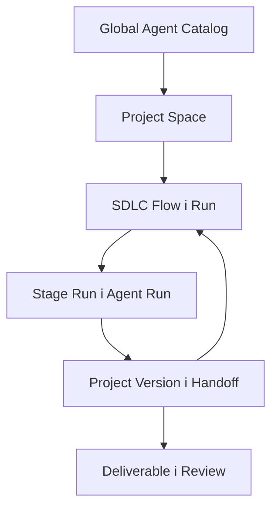

# HarnessPlatform

## Model produktu, założenia i model domeny

**Status dokumentu:** koncepcja produktu i zakres MVP  
**Cel dokumentu:** opisanie produktu, przepływu pełnego SDLC, globalnego katalogu agentów, projektowych wersji agentów, izolowanego wykonania i śledzenia zmian. Dokument nie definiuje modelu bazy danych ani kontraktów API.

---

## 1. Definicja

HarnessPlatform jest systemem SDK-first do prowadzenia kontrolowanego procesu wytwarzania oprogramowania przez agentów. Web jest domyślnym interfejsem człowieka, terminal jest interfejsem alternatywnym, a wszystkie funkcje produktu są budowane na tym samym SDK.

Określenie „platforma” opisuje możliwą skalę mocy wykonawczej — wiele projektów, agentów, sandboxów i użytkowników — a nie osobny produkt.

Najkrótsza definicja:

> **HarnessPlatform prowadzi projekt przez kolejne etapy SDLC wykonywane przez niezależnych agentów, zachowując pełną historię ich działań, zmian plików, przekazań pracy i decyzji człowieka.**

---

## 2. Model produktu

### 2.1. Jeden silnik, kilka interfejsów



Przeglądarka komunikuje się z cienkim hostem Web, który wywołuje SDK. Host nie posiada własnych reguł domenowych. CLI i TUI korzystają z tych samych przypadków użycia.

### 2.2. Produkt a skala

Ten sam produkt może działać w kilku topologiach:

| Skala | Charakterystyka |
|---|---|
| Lokalna | jeden użytkownik, Web lub terminal, lokalne sandboxy |
| Rozszerzona lokalna | wiele równoległych agentów i proces działający w tle |
| Zdalna | workery oraz sandboxy na innych maszynach |
| Zespołowa | wielu użytkowników, wspólne projekty, wiedza i review |
| Organizacyjna | pule wykonawcze, centralne polityki i audyt |

Zmiana skali nie zmienia modelu domenowego ani przepływu pracy.

### 2.3. Główna pętla produktu



Użytkownik:

1. wybiera agentów z globalnego katalogu albo tworzy wersje projektowe,
2. określa etapy procesu SDLC,
3. rozpoczyna wykonanie projektu lub zadania,
4. obserwuje każdego agenta oddzielnie i cały proces łącznie,
5. ocenia artefakty, zmiany kodu i dowody,
6. odsyła etap do poprawy albo pozwala przejść dalej,
7. może zgłosić ulepszoną wersję agenta lub wiedzy do globalnej puli.

---

## 3. Najważniejsza zmiana: agent nie należy do projektu

Agent jest zasobem niezależnym od projektów.

### 3.1. Global Agent Catalog

Global Agent Catalog przechowuje agentów wielokrotnego użytku, np.:

- Product Analyst,
- System Analyst,
- Software Architect,
- Backend Developer,
- Frontend Developer,
- Test Engineer,
- Security Reviewer,
- Code Reviewer,
- Release Engineer.

Globalny agent reprezentuje ogólną kompetencję, którą można zastosować w różnych projektach.

### 3.2. Agent Definition i Global Agent Version

**Agent Definition** jest trwałą tożsamością agenta.  
**Global Agent Version** jest niezmienną, opublikowaną wersją jego zachowania, instrukcji, wymaganych kompetencji i polityk.

Przykład:

```text
Backend Developer
├── global v1
├── global v2
└── global v3
```

Projekt wybiera konkretną wersję, a nie „zawsze najnowszego agenta”.

### 3.3. Project Agent Version

Projekt może utworzyć własną wersję agenta na podstawie wersji globalnej:

```text
Backend Developer global v3
        ↓ fork do projektu
Backend Developer / Billing project v1
        ↓ dalsze dostosowanie
Backend Developer / Billing project v2
```

Projektowa wersja może zawierać:

- zasady konkretnej architektury,
- specjalizację domenową,
- ograniczenia repozytorium,
- inne narzędzia,
- projektowe instrukcje,
- dodatkowe wymagania jakościowe.

Nie modyfikuje wersji globalnej i nie wpływa na inne projekty.

### 3.4. Promocja do globalnej puli

Jeżeli projektowa wersja agenta okazała się ogólnie użyteczna, użytkownik może utworzyć **Agent Promotion Candidate**.

Promocja:

1. wskazuje projektową wersję źródłową,
2. oddziela wiedzę ogólną od projektowej,
3. usuwa informacje poufne i zależne od jednego projektu,
4. podlega review człowieka,
5. tworzy nową Global Agent Version,
6. nie aktualizuje automatycznie istniejących projektów.

Projekt może później świadomie przejść na nową wersję globalną.

---

## 4. Project Space

### 4.1. Znaczenie

Project Space jest trwałą przestrzenią logiczną projektu. Łączy:

- repozytoria i ich rewizje,
- projektowe wersje agentów,
- wiedzę projektową,
- SDLC Flow,
- zadania i wykonania,
- wersje projektu,
- artefakty,
- Change Ledger,
- wyniki testów,
- review i decyzje.

Project Space nie jest jednym współdzielonym katalogiem roboczym.

### 4.2. Project Space a sandbox

Sandboxy agentów żyją w granicy Project Space, ale nie współdzielą swoich środowisk:



Agent B nie otrzymuje sandboxa agenta A. Otrzymuje:

- zaakceptowaną wersję projektu,
- artefakty poprzedniego etapu,
- Handoff Package,
- własny Knowledge Manifest,
- własny świeży workspace,
- własny Harness home.

### 4.3. Project Version

Project Version jest niezmiennym stanem projektu przekazywanym pomiędzy etapami.

Może reprezentować:

- rewizję kodu,
- dokumenty analityczne,
- specyfikację architektury,
- plan testów,
- wyniki weryfikacji,
- inne kontrolowane artefakty projektu.

Nie każdy etap musi modyfikować kod, ale każdy etap może wytworzyć nową wersję projektu lub nową wersję artefaktów.

---

## 5. Pełny przepływ SDLC

### 5.1. SDLC Flow

SDLC Flow definiuje uporządkowany proces prowadzenia pracy przez kolejne role.

Przykład bazowy:



Każdy etap wskazuje:

- cel,
- wymagane wejście,
- oczekiwane artefakty,
- agenta lub kryterium wyboru agenta,
- kryteria ukończenia,
- politykę przejścia dalej,
- ewentualną bramkę człowieka.

### 5.2. SDLC Flow Definition i SDLC Run

**SDLC Flow Definition** jest wielokrotnie używanym opisem procesu.  
**SDLC Run** jest konkretnym wykonaniem tego procesu dla projektu, zadania lub większej inicjatywy.

Jeden SDLC Run składa się z kolejnych **Stage Runs**.

### 5.3. Stage i Stage Run

**Stage** określa rodzaj pracy, np. analiza albo testy.  
**Stage Run** reprezentuje konkretne wykonanie etapu przez konkretną wersję agenta.

Przykład:

```text
SDLC Run: realizacja funkcji płatności
├── Stage Run 1: analiza / Analyst global v2
├── Stage Run 2: architektura / Architect project v4
├── Stage Run 3: implementacja / Backend project v2
├── Stage Run 4: testy / Test Engineer global v3
├── Stage Run 5: poprawki / Backend project v2
└── Stage Run 6: review / Reviewer global v5
```

Agent może pojawić się ponownie w tym samym SDLC Run, ale każde wykonanie jest osobnym Agent Run i posiada osobny sandbox.

### 5.4. Bazowa sekwencyjność

Podstawowym trybem MVP jest sekwencja agentów. Kolejny etap rozpoczyna się po zakończeniu poprzedniego i otrzymuje jego kontrolowane wyjście.

Nie wyklucza to przyszłej równoległości, ale model nie może wymagać równoległych agentów do działania.

### 5.5. Handoff

Handoff Package jest formalnym przekazaniem pracy pomiędzy etapami. Zawiera:

- wskazanie wersji projektu będącej wejściem,
- artefakty poprzedniego etapu,
- podjęte decyzje,
- spełnione i otwarte kryteria,
- znane ryzyka,
- pytania dla kolejnego agenta,
- odnośniki do trajectory i Change Sets.

Handoff przekazuje rezultat, nie środowisko wykonawcze.

---

## 6. Izolacja agentów

### 6.1. Jeden Agent Run, jeden sandbox

Każde wykonanie agenta posiada:

- własny sandbox,
- własny workspace,
- własny Harness home,
- własny session ID DSH,
- własne ograniczone credentials,
- własne limity i politykę sieciową.

Agent nie widzi:

- workspace’u poprzednika,
- Harness home poprzednika,
- sekretów innego agenta,
- niewyeksportowanego stanu poprzedniej sesji,
- storage’u audytowego platformy.

### 6.2. Przekazanie między agentami



Project Space pośredniczy w każdym przekazaniu. Nie istnieje bezpośrednie współdzielenie katalogu A → B.

### 6.3. Wznowienie tego samego agenta

Resume dotyczy tego samego Agent Run albo kolejnego Execution Attempt w jego obrębie. W takim przypadku można ponownie podłączyć jego własny workspace i Harness home.

Uruchomienie następnego agenta zawsze tworzy nowe środowisko.

---

## 7. Śledzenie działań i zmian

### 7.1. Dlaczego DeepSeek Harness

DeepSeek Harness jest używany między innymi dlatego, że zapisuje append-only trajectory: kontekst, działania modelu, wywołania narzędzi i rezultaty. Pozwala obserwować oraz odtwarzać przebieg konkretnego agenta.

Trajectory DSH jest przechowywane per Agent Run i eksportowane poza sandbox.

### 7.2. Cztery źródła historii

| Historia | Odpowiada na pytanie |
|---|---|
| Agent Trajectory | Co widział i robił konkretny agent? |
| File Timeline | Jak zmieniał się konkretny plik w czasie? |
| Project Version History | Jak zmieniał się stan całego projektu? |
| SDLC Run History | Jak kolejne etapy i agenci doprowadzili do rezultatu? |

### 7.3. File Change Event

File Change Event reprezentuje zaobserwowaną zmianę pliku w czasie Agent Run:

- utworzenie,
- modyfikację,
- usunięcie,
- zmianę nazwy,
- zmianę typu lub zawartości binarnej.

Zdarzenie jest korelowane z najbliższym działaniem DSH, ale jest rejestrowane przez niezależny tracker.

### 7.4. File Version

File Version reprezentuje utrwalony stan pliku w checkpointcie lub wersji projektu.

Dzięki temu platforma może pokazać:

- historię jednego pliku,
- diff przed i po działaniu agenta,
- kolejne wersje pliku w SDLC,
- agentów, którzy zmieniali plik,
- zmianę, która została później zastąpiona przez kolejnego agenta.

### 7.5. Change Set

Change Set grupuje zmiany plików realizujące jeden logiczny zamiar. Należy zawsze do jednego Agent Run i zawiera jawne uzasadnienie, kryterium, ryzyko i dowód weryfikacji.

### 7.6. Perspektywy diffu

Platforma musi obsługiwać co najmniej cztery perspektywy:

1. **Per Agent** — wejście danego agenta kontra jego wyjście.
2. **Per Stage** — wejście etapu kontra zaakceptowane wyjście etapu.
3. **Per File** — wszystkie wersje wybranego pliku w czasie.
4. **Global Project Diff** — początek SDLC Run kontra aktualna lub końcowa Project Version.

### 7.7. Atrybucja zmian

Jeżeli agent B zmieni linie napisane wcześniej przez agenta A, platforma zachowuje oba fakty:

- agent A wprowadził pierwszą zmianę,
- agent B ją zmodyfikował albo zastąpił.

Końcowego autorstwa nie należy upraszczać do Git blame. Źródłem atrybucji jest diff wejście–wyjście każdego Agent Run oraz chronologiczna historia wersji.

---

## 8. Przepływ wykonania

Przykład realizacji jednej funkcji:

### 8.1. Utworzenie pracy

Użytkownik wybiera Project Space, definiuje cel i wybiera SDLC Flow.

System tworzy SDLC Run ze wskazaną bazową Project Version.

### 8.2. Etap analizy

1. Flow wybiera Analyst Agent.
2. Powstaje Agent Run.
3. Platforma tworzy świeży sandbox.
4. Agent otrzymuje wymagania, wiedzę i bazową Project Version.
5. DSH zapisuje trajectory.
6. Agent tworzy analizę i Handoff Package.
7. Wynik trafia do Project Space.
8. Sandbox analityka zostaje zatrzymany lub usunięty zgodnie z retencją.

### 8.3. Etap architektury

Architect Agent otrzymuje analizę i właściwą Project Version w nowym sandboxie. Nie otrzymuje środowiska analityka.

Tworzy decyzje architektoniczne, plan implementacji i kolejny handoff.

### 8.4. Etap implementacji

Developer Agent rozpoczyna od wskazanej Project Version. Tracker zapisuje jego File Change Events, File Versions i Change Sets. Agent przedstawia testy wykonane we własnym środowisku.

### 8.5. Etap testów

Test Agent otrzymuje wynik implementacji w czystym sandboxie. Dzięki temu sprawdza projekt niezależnie od środowiska developera.

Może:

- zaakceptować dowody,
- wykryć błąd,
- utworzyć raport,
- skierować flow ponownie do etapu implementacji.

### 8.6. Review

Reviewer Agent może przygotować pomocniczą ocenę, ale decyzja końcowa należy do człowieka, jeżeli polityka projektu wymaga human gate.

### 8.7. Integracja

Zaakceptowana Project Version może zostać zastosowana jako patch, commit, branch albo pull request. Integracja jest osobnym faktem od akceptacji.

---

## 9. Model domenowy

### 9.1. Katalog agentów

#### Global Agent Catalog

Globalna pula agentów dostępna niezależnie od projektów.

#### Agent Definition

Trwała tożsamość i przeznaczenie agenta.

#### Global Agent Version

Niezmienna, opublikowana wersja agenta przeznaczona do ponownego użycia.

#### Project Agent Version

Projektowa wersja wyprowadzona z wersji globalnej albo utworzona lokalnie w projekcie. Zachowuje informację o swoim pochodzeniu.

#### Agent Promotion Candidate

Kontrolowana propozycja utworzenia nowej wersji globalnej na podstawie doświadczeń projektu.

### 9.2. Projekt

#### Project

Trwała tożsamość przedsięwzięcia.

#### Project Space

Granica przechowywania kodu, wiedzy, agentów projektowych, procesów, wersji, artefaktów i audytu projektu.

#### Repository

Źródło kodu i docelowe miejsce integracji.

#### Project Version

Niezmienny, przekazywalny stan projektu w określonym momencie SDLC.

### 9.3. Wiedza

#### Knowledge Pack

Tematycznie spójna wiedza ogólna albo projektowa.

#### Knowledge Version

Niezmienna wersja Knowledge Pack.

#### Knowledge Manifest

Zamknięty zestaw wiedzy przekazany do konkretnego Agent Run.

#### Knowledge Promotion Candidate

Projektowa wiedza zgłoszona do uogólnienia i przeniesienia do puli globalnej.

### 9.4. Praca i SDLC

#### Work Item

Cel biznesowy lub techniczny prowadzony przez SDLC Flow. Task może być najprostszym rodzajem Work Item.

#### Acceptance Criterion

Warunek, na podstawie którego ocenia się rezultat.

#### SDLC Flow Definition

Wielokrotnie używana definicja etapów, zależności i bramek.

#### Stage

Definicja jednego etapu procesu.

#### SDLC Run

Konkretne wykonanie SDLC Flow dla Work Item i bazowej Project Version.

#### Stage Run

Konkretne wykonanie jednego etapu w ramach SDLC Run.

#### Agent Assignment

Wybór konkretnej Global Agent Version albo Project Agent Version dla Stage Run.

#### Handoff Package

Kontrolowane wyjście etapu przeznaczone dla następnego etapu.

### 9.5. Wykonanie

#### Agent Run

Logiczna historia pracy jednego agenta w jednym Stage Run.

#### Execution Attempt

Pojedyncze uruchomienie procesu DSH w obrębie Agent Run. Resume może utworzyć kolejny attempt bez zmiany tożsamości Agent Run.

#### Runtime Profile

Przypięta wersja DSH oraz kompozycja pluginów.

#### Model Profile

Kontrolowana trasa do modelu, domyślnie LiteLLM → MiniMax.

#### Sandbox Policy

Reguły izolacji, zasobów, sieci, narzędzi i retencji.

#### Sandbox

Środowisko jednego Agent Run.

#### Workspace

Kopia wejściowej Project Version dostępna w sandboxie.

#### Harness Home

Izolowany stan DSH danego Agent Run.

#### Agent Trajectory

Append-only historia działania DSH dla jednego Agent Run.

### 9.6. Zmiany i wersje

#### File Change Event

Zaobserwowana zmiana pliku w czasie.

#### File Version

Utrwalony stan pliku powiązany z checkpointem albo Project Version.

#### Change Set

Logiczna grupa zmian wykonana przez jednego agenta.

#### Checkpoint

Odtwarzalny stan workspace’u w czasie Agent Run.

#### Verification Evidence

Zaobserwowany dowód testu, kompilacji, analizy lub innej weryfikacji.

### 9.7. Rezultaty i nadzór

#### Stage Deliverable

Rezultat jednego etapu przekazany do bramki lub następnego etapu.

#### Project Deliverable

Zintegrowany rezultat całego SDLC Run.

#### Review

Proces oceny Stage Deliverable albo Project Deliverable.

#### Review Decision

Decyzja Approve, Request Changes albo Reject.

#### Integration

Zastosowanie zaakceptowanej Project Version w docelowym repozytorium.

---

## 10. Relacje



Znaczenie relacji:

- Global Agent Catalog istnieje niezależnie od projektów.
- Project Space wybiera globalne wersje albo tworzy wersje projektowe.
- SDLC Run realizuje Work Item przez sekwencję Stage Runs.
- Każdy Stage Run otrzymuje konkretną wersję agenta.
- Każdy Agent Run działa we własnym sandboxie.
- Agent Run otrzymuje Project Version i wytwarza nową wersję lub artefakty.
- Handoff Package przenosi rezultat do następnego etapu.
- Review może skierować flow do wcześniejszego etapu.
- Projektowa wersja agenta lub wiedzy może zostać zgłoszona do promocji globalnej.

---

## 11. Niezmienniki domenowe

1. Agent Definition istnieje niezależnie od projektu.
2. Projekt zawsze używa konkretnej, niezmiennej wersji agenta.
3. Project Agent Version nie zmienia wersji globalnej, z której powstała.
4. Promocja projektowej wersji tworzy nową wersję globalną i wymaga review.
5. Istniejące projekty nie aktualizują agentów automatycznie po promocji.
6. SDLC Run posiada bazową Project Version i realizuje jeden Work Item.
7. Stage Run należy do jednego SDLC Run.
8. Agent Run wykonuje jeden agent w ramach jednego Stage Run.
9. Każdy Agent Run posiada własny sandbox, workspace i Harness home.
10. Następny agent nie otrzymuje sandboxa poprzednika.
11. Dane przechodzą między agentami wyłącznie przez Project Version, artefakty i Handoff Package.
12. Resume może ponownie użyć stanu wyłącznie tego samego Agent Run.
13. Trajectory DSH jest przechowywane osobno dla każdego Agent Run.
14. Historia zmian plików jest rejestrowana niezależnie od trajectory.
15. Każdy Change Set należy do jednego Agent Run.
16. Global Project Diff może obejmować wiele agentów i etapów.
17. Zmiana później zastąpiona pozostaje w historii autora i czasu wykonania.
18. Git blame nie jest źródłem domenowej atrybucji agentów.
19. Stage Deliverable nie jest automatycznie akceptowany, jeśli etap posiada bramkę człowieka.
20. Reviewer Agent może doradzać, ale nie zastępuje wymaganej decyzji człowieka.
21. Approved nie oznacza automatycznie Integrated.
22. Usunięcie sandboxa nie może usunąć trajectory, Change Ledger ani zaakceptowanych artefaktów.
23. Wiedza albo agent utworzone w projekcie nie trafiają do globalnej puli bez kontrolowanej promocji.

---

## 12. Zakres MVP

### 12.1. Bazowy SDLC Flow

MVP powinno obsłużyć co najmniej sekwencję:

1. analiza,
2. architektura lub plan,
3. implementacja,
4. testy,
5. review,
6. poprawki i ponowne testy, jeśli są wymagane.

Role mogą być skonfigurowane jako osobni agenci globalni albo projektowi.

### 12.2. Funkcje wymagane

- Global Agent Catalog,
- wersjonowanie agentów globalnych,
- utworzenie Project Agent Version,
- zgłoszenie projektowego agenta do promocji globalnej,
- Project Space,
- wersjonowana wiedza globalna i projektowa,
- definicja prostego sekwencyjnego SDLC Flow,
- SDLC Run oraz Stage Runs,
- wybór wersji agenta dla etapu,
- osobny sandbox, workspace i Harness home per Agent Run,
- DSH trajectory per agent,
- przekazywanie Project Version i Handoff Package,
- File Change Events i File Versions,
- diff per agent, etap, plik i cały projekt,
- Change Sets z uzasadnieniami,
- checkpointy i Verification Evidence,
- Stage Deliverables,
- human review na skonfigurowanych bramkach,
- cofnięcie flow do wcześniejszego etapu,
- Project Deliverable i kontrolowana integracja,
- Web jako domyślny interfejs,
- terminal jako alternatywny interfejs,
- wspólny silnik i SDK dla obu interfejsów.

### 12.3. Poza MVP

- równoległe modyfikowanie tej samej Project Version przez wielu agentów,
- automatyczne rozwiązywanie konfliktów między równoległymi gałęziami,
- dynamiczne tworzenie nieograniczonych zespołów przez managera AI,
- obsługa harnessów innych niż DSH,
- publiczny marketplace agentów,
- automatyczna promocja wiedzy i agentów,
- publiczny multi-tenant SaaS,
- automatyczne wdrożenie produkcyjne,
- Kubernetes jako wymaganie instalacyjne.

---

## 13. Kryterium powodzenia

MVP jest poprawne, jeśli użytkownik może:

1. wybrać kilku agentów z globalnej puli,
2. utworzyć projektową wersję przynajmniej jednego agenta,
3. skonfigurować sekwencję etapów SDLC,
4. uruchomić pełny przepływ dla jednego Work Item,
5. obserwować trajectory każdego agenta,
6. potwierdzić, że każdy agent działał we własnym sandboxie,
7. zobaczyć przekazanie Project Version i Handoff Package,
8. przejrzeć historię wybranego pliku,
9. zobaczyć diff konkretnego agenta,
10. zobaczyć globalny diff całego SDLC Run,
11. ustalić, który agent wprowadził, zmienił albo zastąpił określoną zmianę,
12. cofnąć rezultat z testów lub review do implementacji,
13. zaakceptować końcowy Project Deliverable,
14. zgłosić projektową wersję agenta do globalnej puli.

Jeżeli agenci współdzielą jeden writable workspace, nie istnieje wiarygodny handoff albo nie da się rozdzielić zmian poszczególnych agentów, implementacja nie realizuje tego modelu.

