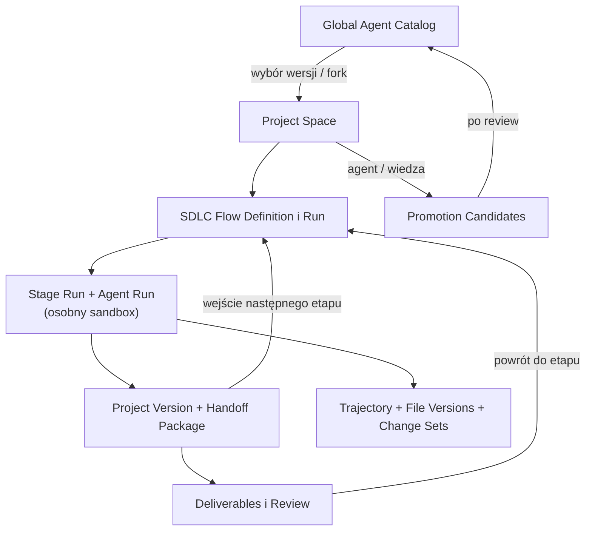
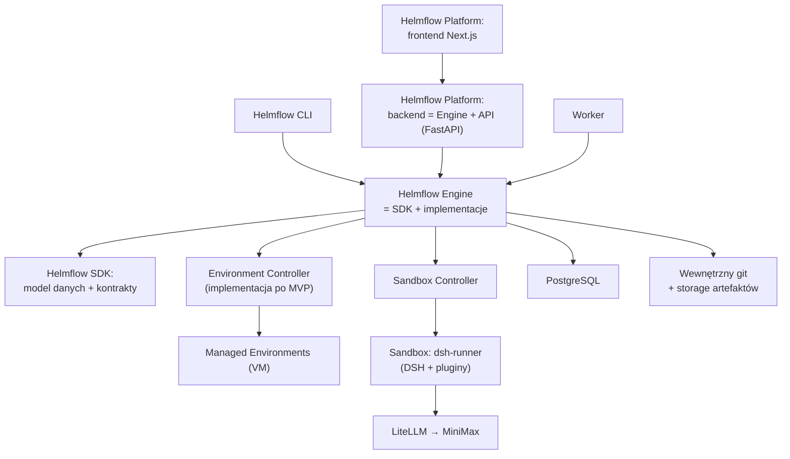
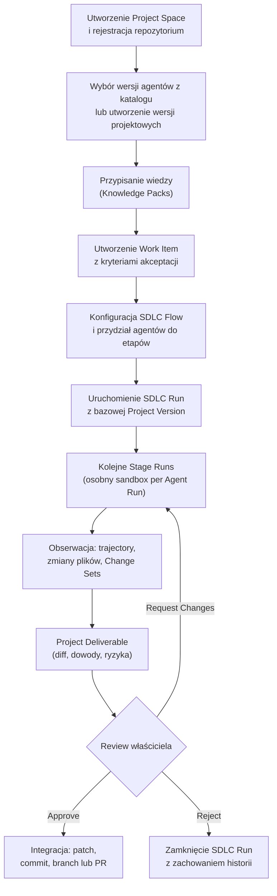
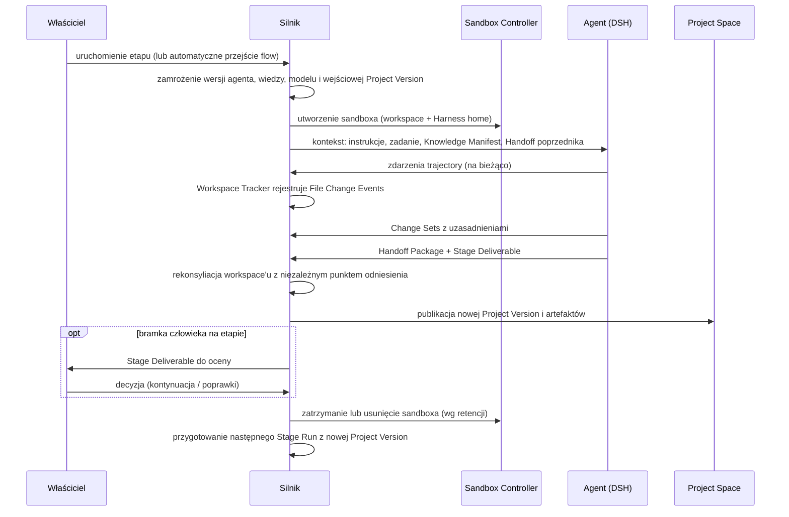
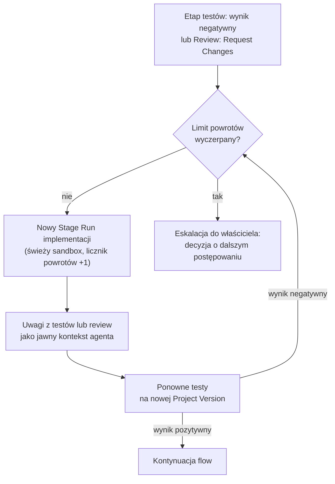
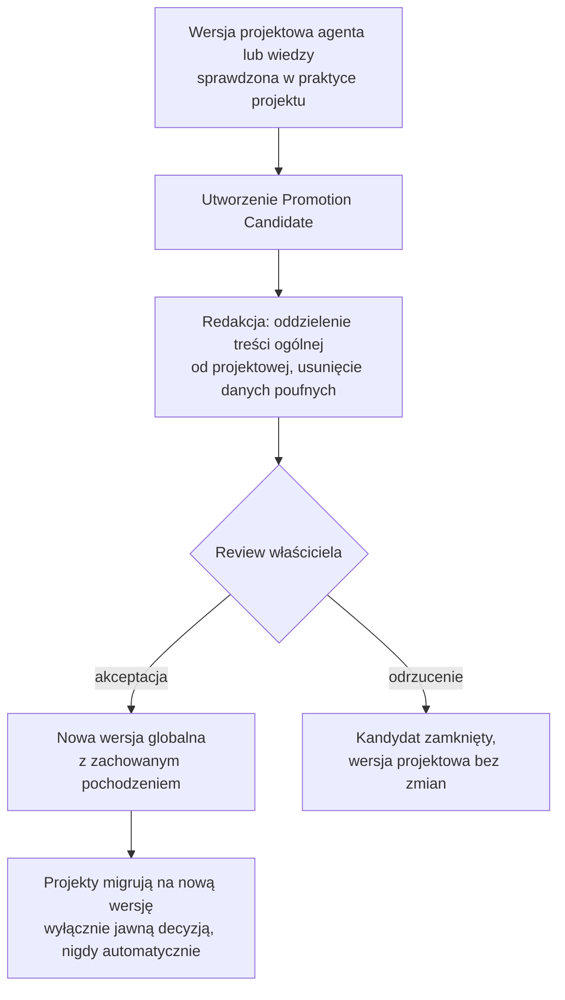
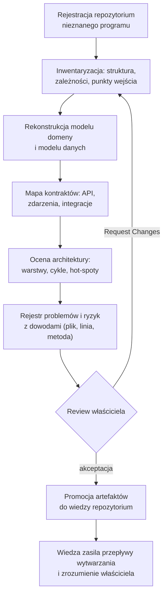
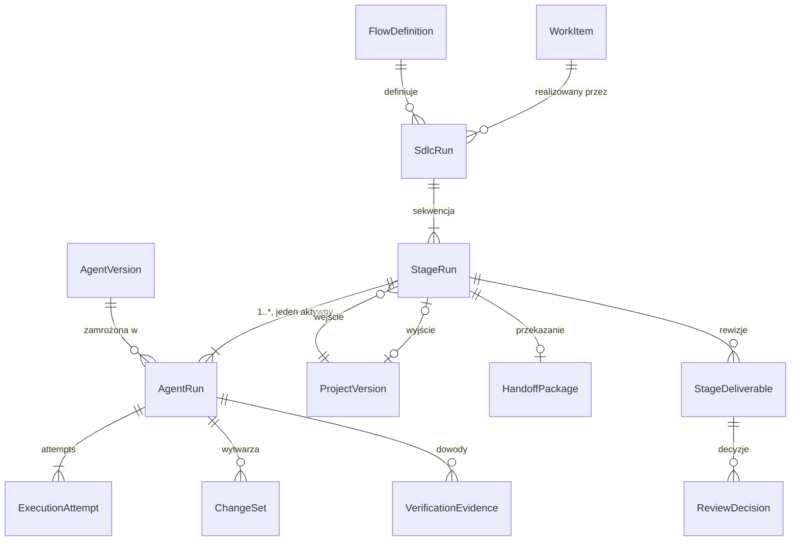

# Helmflow — dokument produktowy

**Wersja dokumentu:** 0.8 (rejestr zmian na końcu dokumentu)
**Status:** wiążący dokument produktowy — samodzielne źródło prawdy projektu i punkt wejścia dla agenta implementującego
**Decyzje:** sekcja 2 (D1–D9); przy konflikcie z resztą dokumentu decyzje mają pierwszeństwo.

---

## 1. Czym jest Helmflow

Helmflow jest przede wszystkim **SDK** — biblioteką udostępniającą funkcje DSH i pozostałych zależności w ramach jednolitego modelu domeny i API. Na SDK zbudowany jest **silnik** prowadzenia pełnego procesu SDLC przez sekwencję niezależnych agentów programistycznych, a na silniku **platforma** (backend + frontend Next.js). Self-hosting jest sposobem dostarczenia platformy, nie istotą produktu.

> **Helmflow prowadzi projekt przez kolejne etapy SDLC wykonywane przez niezależnych agentów, zachowując pełną historię ich działań, zmian plików, przekazań pracy i decyzji człowieka.**

Helmflow obsługuje dwa równorzędne przypadki użycia na tym samym silniku i modelu domeny:

1. **Wytwarzanie** — dodawanie i zmiana funkcji oprogramowania przez sekwencję agentów (analiza → architektura → implementacja → testy → review).
2. **Rozumienie** — rozpracowanie programu, którego zespół nie zna: rekonstrukcja modelu domeny, modelu danych, kontraktów i architektury wraz z rejestrem problemów, w formie artefaktów z dowodami (sekcja 6.7). Zatwierdzone artefakty zrozumienia stają się wiedzą repozytorium i zasilają kolejne przepływy wytwarzania.

Oba przypadki mogą korzystać z Managed Environments — izolowanych, prawdziwych środowisk (maszyn wirtualnych z zainstalowanymi platformami), wykorzystywanych przez agentów w granicach projektu (kontrakt w MVP, implementacja po MVP — D8.3).

### Problem

Programista pracujący z agentami kodującymi:

- traci kontakt z własną bazą kodu — przestaje wiedzieć, co i dlaczego się zmieniło,
- obserwuje spadek jakości: funkcje przestają działać, narastają błędy,
- nie jest w stanie osobiście pilnować wdrażania prostych funkcji, testów i architektury — a bez niego nikt tego nie pilnuje.

Helmflow istnieje po to, aby właściciel projektu mógł **rozdzielić swoje umiejętności między agentów w SDLC** — utrwalić swoją wiedzę w wersjonowanych agentach i paczkach wiedzy — oraz **czytelnie obserwować zmiany, wersje i różnice**, zachowując kontrolę bez ręcznego nadzoru nad każdym krokiem.

### Grupa docelowa

Programiści open source, którzy chcą zautomatyzować własny SDLC i zachować nad nim kontrolę. Pierwszym użytkownikiem i punktem odniesienia produktu jest właściciel projektu (sekcja 8.6); MVP jest budowane i mierzone dla tego jednego użytkownika, a poszerzenie na grupę docelową wymaga walidacji po MVP.

Filary produktu:

1. **Agent nie należy do projektu** — istnieje Global Agent Catalog; projekty forkują wersje globalne do wersji projektowych i mogą je w kontrolowany sposób promować z powrotem.
2. **Pełny SDLC, nie pojedyncze zadanie** — praca płynie przez zdefiniowany flow etapów (analiza → architektura → implementacja → testy → review), a każdy etap wykonuje osobny agent w osobnym sandboxie.
3. **Przekazanie pracy tylko przez Project Space** — agenci nie współdzielą środowisk; między etapami przepływa wyłącznie niezmienna Project Version + Handoff Package.
4. **Cztery niezależne źródła historii** — trajectory agenta, historia plików, historia wersji projektu i historia decyzji człowieka; żadne nie udaje pozostałych.
5. **Człowiek zachowuje kontrolę** — agent nie zatwierdza własnej pracy; Approved ≠ Integrated.
6. **Warstwy produktu: Helmflow SDK → Engine → Platform** — platforma (Next.js + backend), CLI i aplikacje użytkownika korzystają z tego samego silnika zbudowanego na SDK (D3).

**Platforma** oznacza warstwę aplikacyjną produktu: backend + frontend Next.js, dostarczane razem jako instalacja self-hosted. Skala wykonania (wiele projektów, agentów, sandboxów, użytkowników) jest własnością silnika — zmiana skali nie zmienia modelu domenowego.

---

## 2. Decyzje wiążące (ADR-y poziomu produktu)

Poniższe decyzje zostały podjęte przez właściciela i **nie podlegają renegocjacji przez agenta implementującego**. Zmiana którejkolwiek wymaga powrotu do właściciela. Przy konflikcie między decyzjami pierwszeństwo ma decyzja o wyższym numerze (późniejsza); nowelizacje są odnotowane przy decyzji pierwotnej.

### D1. Nazwa: Helmflow

Produkt, repozytorium i przestrzenie nazw kodu używają nazwy **Helmflow**. Organizacja GitHub: `Helmflow`.

### D2. Zakres: pełny zakres MVP

MVP obejmuje pełny zakres funkcjonalny produktu, w tym:

- Global Agent Catalog z wersjonowaniem i projektowymi forkami,
- pełne przepływy promocji (Agent Promotion Candidate i Knowledge Promotion Candidate: kandydat → redakcja → review → nowa wersja globalna),
- CLI jako pełnoprawny drugi interfejs obok Web,
- wszystkie cztery perspektywy diffu (per agent, per etap, per plik, globalna) z pełną atrybucją zmian między agentami.

Nowelizacja (2026-09-05, wynika z D9.3): Web pozostaje w zakresie produktu, ale nie jest warunkiem ukończenia MVP — Definition of Done realizują TUI i headless przez kontrakt silnika.

Uwaga wykonawcza: atrybucja na poziomie **wersji pliku** jest wymogiem twardym; atrybucja na poziomie linii („który agent ostatnio dotknął ten fragment") jest w zakresie, ale jej koszt należy zweryfikować w kroku 19 — jeśli okaże się nieproporcjonalny, agent implementujący przedstawia problem właścicielowi zamiast samodzielnie redukować zakres.

### D3. Warstwy produktu: Helmflow SDK → Engine → Platform

Sformułowanie właściciela (ostateczne, 2026-09-04): *SDK to jednolity model danych i kontrakty części składowych. Silnik = SDK + inne. Backend = silnik + API. Platforma = Next.js + backend.*

Obowiązująca interpretacja — warstwy, które są zarazem granicami produktów:

- **Helmflow SDK (fundament)** — jednolity model danych i kontrakty (interfejsy) części składowych: runtime agenta, sandbox, wersje projektu, wiedza, zdarzenia, storage. Czysta, publikowalna samodzielnie biblioteka Pythona bez zależności technicznych; zewnętrzny konsument może implementować jej kontrakty bez pozostałych warstw. **SDK nie jest klientem HTTP i nie wolno go tak implementować** — konsumenci używają go przez import, nigdy przez sieć.
- **Helmflow Engine (silnik) = SDK + inne** — implementacje kontraktów SDK (integracja DSH, sandbox, wewnętrzny git, storage, PostgreSQL) oraz przypadki użycia, orkiestracja SDLC, trwały stan, kolejka i zdarzenia. Ma własny, stabilny kontrakt programistyczny — nie jest wewnętrznym API backendu.
- **Backend = Engine + API** — cienki host FastAPI osadzający silnik in-process i wystawiający API przeglądarce; jedyne domenowe HTTP w systemie. Zero własnych reguł domenowych.
- **Helmflow Platform (platforma) = backend + frontend Next.js** — frontend serwuje wyłącznie UI (zero logiki domenowej); razem dostarczane jako instalacja self-hosted (Compose), wraz z workerem do długich operacji. Backend i frontend pozostają jednym produktem, dopóki nie pojawi się drugi konsument backendu — przedwczesny rozdział mnoży wersjonowanie bez korzyści.
- **Helmflow CLI** osadza silnik lokalnie i działa bez backendu.
- Koordynacja wielu procesów osadzających silnik odbywa się **wyłącznie przez współdzielony trwały stan** (PostgreSQL): trwała kolejka pracy, idempotencja operacji, zdarzenia na żywo przez `LISTEN/NOTIFY`. Żaden proces nie trzyma stanu domenowego wyłącznie w pamięci. Skalowanie (workery i sandboxy na innych maszynach) realizuje się przez kolejne procesy osadzające silnik i podpięte do tej samej bazy — nie przez zdalne SDK.
- Kierunek po MVP (nie w zakresie MVP): tryb w pełni lokalny bez serwera bazy — stan jako plik (np. SQLite) za tą samą abstrakcją repozytorium stanu. Abstrakcję warstwy trwałości projektować tak, by tej opcji nie zamknąć.

Rozstrzygnięcie nazewnicze: w projekcie istnieją **dwa różne SDK** — `deepseek-harness-sdk` (runtime agenta, działa **wewnątrz** sandboxa) i **Helmflow SDK** (jednolity model danych i kontrakty, działa **poza** sandboxem). ADR z kroku 2 brzmi: „DSH i jego Python SDK działają wewnątrz sandboxa; Helmflow SDK i silnik działają poza nim."

### D4. Project Version: wewnętrzny git + manifest

- Każdy Project Space posiada **wewnętrzne bare-repozytorium git** zarządzane przez platformę, przechowywane poza zasięgiem sandboxów. Kod każdej Project Version jest commitem w tym repozytorium.
- **Artefakty etapów (analizy, plany, raporty testów) są plikami w workspace** — dzięki temu płyną naturalnie przez Project Versions i podlegają tej samej historii co kod.
- **Manifest Project Version** w PostgreSQL wiąże: SHA commitu wewnętrznego, identyfikatory artefaktów wielkogabarytowych w storage obiektowym, metadane (SDLC Run, Stage Run, Agent Run, czas, poprzednik).
- Diffy, historia plików i porównania wersji wykorzystują mechanikę git (plumbing) na wewnętrznym repozytorium — nie na `.git` widzianym przez agenta, który nie jest zaufany.
- Repozytorium użytkownika jest źródłem bazowej rewizji i celem integracji (patch/commit/PR); pomiędzy etapami kod żyje wyłącznie w magazynie wewnętrznym.

### D5. Decyzje bazowe (potwierdzone)

1. DeepSeek Harness (DSH) jest jedynym runtime'em agenta w MVP. DSH to harness agenta kodującego: prowadzi pętlę model–narzędzia (edycja plików, wykonywanie poleceń), utrzymuje sesję z możliwością wznowienia i zapisuje append-only trajectory (kontekst, wywołania narzędzi, wyniki) w logu JSONL. Wersja przypięta (pakiet i obraz po digest); rozszerzany pluginami, nigdy modyfikowany w rdzeniu. Właściciel potwierdził tę decyzję 2026-09-04, świadomie akceptując ryzyko developer preview; ubezpieczeniem pozostają granica `packages/runtime-dsh` i testy kontraktowe.
2. MiniMax jest modelem domyślnym, dostępnym **wyłącznie** przez LiteLLM; główny klucz MiniMax nigdy nie trafia do sandboxa; sesje dostają ograniczone, krótkotrwałe poświadczenia.
3. Jeden Agent Run = jeden sandbox = jeden workspace = jeden Harness home = jeden session ID DSH. Innymi słowy: każde wykonanie agenta otrzymuje własny, jednorazowy komplet — kontener, w którym działa (sandbox), świeżą kopię projektu, na której pracuje (workspace), osobny katalog stanu i logów DSH (Harness home) oraz własną sesję DSH; żaden element kompletu nie jest współdzielony z innym wykonaniem, a resume podpina się zawsze do tego samego kompletu.
4. Audytowe źródło prawdy (wersje, zdarzenia, checkpointy, diffy, decyzje) żyje poza sandboxem.
5. Trajectory DSH, historia plików, historia wersji projektu i review to odrębne, skorelowane zapisy.
6. Izolacją wykonania w MVP są kontenery (rootless Docker lub Podman). Kontener skutecznie ogranicza agenta, ale nie daje gwarancji izolacji na poziomie maszyny wirtualnej — to akceptowalny poziom ochrony dla instalacji, w której jedyny użytkownik uruchamia agentów na własnej maszynie. Nie jest to poziom wystarczający dla publicznej usługi, w której obcy sobie użytkownicy współdzielą infrastrukturę; mocniejsza izolacja (gVisor, microVM) pozostaje kierunkiem po MVP.

### D6. Uzupełnienia przyjęte na podstawie analizy (wiążące)

1. **Budżety i limity pętli.** SDLC Flow Definition określa maksymalną liczbę powrotów do wcześniejszego etapu (domyślnie 2); SDLC Run i Agent Run mają budżet tokenów/kosztu — definiowany w Model Profile, egzekwowany przez silnik — widoczny w UI. Przekroczenie budżetu zatrzymuje pracę i wymaga decyzji człowieka; przerwanie bez sygnalizacji jest niedopuszczalne.
2. **Stan Blocked.** Agent Run może przejść w stan Blocked z jawnym pytaniem do człowieka; odpowiedź człowieka wraca jako jawny kontekst i wznawia ten sam Agent Run. To jedyny kanał eskalacji w trakcie etapu.
3. **Uwierzytelnienie.** Instalacja jednoosobowa ≠ brak logowania. Hostowane API (backend) wymaga uwierzytelnienia: pojedynczy użytkownik, token/sesja. CLI osadza silnik in-process, więc jego granicą ochrony jest dostęp do bazy i plików instalacji, nie osobne logowanie. Testy bezpieczeństwa obejmują nieuwierzytelniony dostęp do API, nie tylko ucieczkę z sandboxa.
4. **Fallback handoffu.** Handoff Package ma walidowany schemat i jest tworzony przez agenta narzędziem platformy. Gdy agent zakończy pracę bez poprawnego handoffu, platforma składa **minimalny handoff zastępczy** (Project Version, diff, artefakty, brak sekcji decyzyjnych) i oznacza Stage Deliverable jako zdegradowany — etap zostaje domknięty, a status degradacji jest widoczny w review.
5. **File Change Events są telemetrią.** Źródłem prawdy o zmianach jest rekonsyliacja Project Version wejściowej z wyjściową (niezależny skan). Strumień FCE służy obserwacji na żywo i korelacji z trajectory; jego ewentualne luki nie unieważniają audytu.
6. **Niezmiennik sekwencyjności:** SDLC Run ma w danym momencie co najwyżej jeden aktywny Stage Run.
7. **Flow o długości 1+ jest pełnoprawny.** Platforma dostarcza bazowy flow (analiza → architektura → implementacja → testy → review) jako szablon, ale run z mniejszą liczbą etapów (np. implementacja → testy) jest poprawny. Bazowy pełny flow musi być obsłużony w teście odbiorczym.

### D7. Poprawki przebiegu planu (2026-09-04)

Przyjęte przez właściciela po ocenie krytycznej planu:

1. **Gate A′ — bramka tezy produktowej** (sekcja 10): przed rozbudową rdzenia porównujemy ten sam Work Item wykonany jednym agentem i flow wieloetapowym. Plan przestaje testować najdroższe ryzyko — wartość wieloagentowego SDLC — dopiero na końcu.
2. **Kamień milowy MVP-0 (dogfooding)**: minimalna pętla produktu powstaje bezpośrednio po fundamencie (minimalne wersje kroków 6–8) i od tego momentu Helmflow jest rozwijany Helmflowem.
3. **Katalog globalny i promocje przeniesione na koniec** (z kroków 11–12 do kroku 21a): rdzeń domenowy potrzebuje wcześniej wyłącznie niezmiennych wersji agentów jako rekordów; nic w krokach 13–21 nie zależy od katalogu ani promocji.
4. **Proxy egress zamiast filtrowania per kontener**: cały ruch wychodzący sandboxa idzie przez proxy egress. Dozwolone trasy: LiteLLM, ingest zdarzeń oraz — decyzją właściciela z 2026-09-05 — oficjalne rejestry pakietów (np. PyPI, npm) z cache, według allowlisty per projekt zapisanej w Sandbox Policy i widocznej w audycie. Rezygnujemy z filtrowania sieci per kontener w trybie rootless; ryzyko łańcucha dostaw pakietów wchodzi jawnie do threat modelu (krok 2).

Zakres MVP (D2) pozostaje pełny — zmienia się kolejność i punkty pomiaru, nie lista funkcji. Właściciel potwierdził jednocześnie DSH jako jedyny runtime (świadoma akceptacja ryzyka developer preview — patrz D5.1).

### D8. Rozszerzenia produktowe (2026-09-04)

Przyjęte przez właściciela po analizie przypadków użycia:

1. **Dwa równorzędne przypadki użycia: wytwarzanie i rozumienie.** Przepływ zrozumienia programu jest szablonem flow dostarczanym w MVP (sekcja 6.7). Dowód twierdzenia analitycznego ma postać odnośnika do kodu (plik, linia) wraz z metodą ustalenia; twierdzenie bez dowodu jest oznaczane jako deklaracja agenta. Zatwierdzone artefakty analizy są promowane do wiedzy repozytorium (Knowledge Candidate) i zasilają przepływy wytwarzania.
2. **Helmflow CLI = tryb komendowy + TUI.** TUI (Textual) z oknami i zakładkami: podgląd pracy agentów na żywo, przeglądanie prac i rezultatów, zlecanie zadań, review. Parytet z Web jest definiowany na poziomie przypadków użycia — gwarantowany wspólnym kontraktem Engine — nie na poziomie lustrzanych ekranów.
3. **Managed Environments.** Projekt może posiadać izolowane, długożyjące środowiska: prawdziwe platformy instalowane na maszynach wirtualnych (np. system operacyjny w VirtualBox/libvirt), przypisywalne do etapów (np. testów), zasilane kodem z repozytorium lub Project Version, dostępne do edycji, uruchamiania i weryfikacji. Środowisko jest zasobem, na którym agent operuje wyłącznie przez Environment Controller; agent nigdy nie otrzymuje dostępu do hosta. Kontrakt środowisk w SDK i pojęcie domenowe powstają w MVP; implementacja kontrolera następuje po MVP.

### D9. Kolejność budowy i priorytet interfejsów (2026-09-04)

Przyjęte przez właściciela:

1. **Budowa od dołu warstw.** Kolejność realizacji: najpierw **Helmflow SDK** w wersji minimalnej, rozbudowywane iteracyjnie; następnie **Engine**; następnie **backend + CLI/TUI**. Warstwa wyższa nie powstaje przed użytecznym minimum warstwy niższej.
2. **Jakość przez testy kontraktowe od pierwszego pakietu.** Każdy kontrakt SDK powstaje razem z zestawem testów kontraktowych niezależnym od implementacji (wspólny test kit); każda implementacja kontraktu w Engine musi przechodzić ten sam zestaw. Kontrakt bez testów jest nieukończony.
3. **Web UI odroczony.** Web pozostaje w docelowym zakresie produktu, ale nie jest budowany teraz — pierwszym interfejsem użytkownika jest CLI/TUI (D8.2), a odbiór MVP następuje przez TUI i headless przez kontrakt silnika. MVP-0 jest realizowane w TUI, bez Web. Backend (host API) powstaje jako fundament pod przyszły Web, lecz żaden krok nie jest blokowany przez interfejs przeglądarkowy.
4. **Konwencja matrioszki (2026-09-05).** Budowa produktu wyższej warstwy zawsze pociąga za sobą zbudowanie z lokalnych źródeł monorepo wszystkich warstw niższych — szczegóły w sekcji 7, „Konwencja budowy: matrioszka".

---

## 3. Model domeny (synteza)

Model opisuje pojęcia biznesowe; nie przesądza tabel, dokumentów ani zdarzeń. Odpowiedzialności warstw i logika biznesowa silnika: sekcja 4. Przepływy użytkownika operujące na tych pojęciach: sekcja 6. Techniczna budowa modeli danych: sekcja 7; specyfikacja startowa klas: Załącznik A.

### 3.1. Katalog agentów

| Pojęcie | Definicja |
|---|---|
| **Global Agent Catalog** | Pula agentów wielokrotnego użytku, niezależna od projektów. |
| **Agent Definition** | Trwała tożsamość i przeznaczenie agenta (np. Backend Developer). |
| **Global Agent Version** | Niezmienna, opublikowana wersja zachowania, instrukcji, kompetencji i polityk agenta. |
| **Project Agent Version** | Projektowa wersja wyprowadzona z globalnej (fork) albo utworzona lokalnie; zachowuje pochodzenie; nie modyfikuje wersji globalnej. |
| **Agent Promotion Candidate** | Kontrolowana propozycja nowej wersji globalnej na bazie wersji projektowej; wymaga oddzielenia wiedzy ogólnej od projektowej, redakcji danych poufnych i review człowieka; nie aktualizuje automatycznie istniejących projektów. |
| **Role** | Wzorzec odpowiedzialności (nie jest uruchamialnym agentem). |

### 3.2. Projekt i wersje

| Pojęcie | Definicja |
|---|---|
| **Project** | Trwała tożsamość przedsięwzięcia. |
| **Project Space** | Granica przechowywania kodu, wiedzy, agentów projektowych, procesów, wersji, artefaktów i audytu. Nie jest współdzielonym katalogiem roboczym. |
| **Repository** | Zewnętrzne źródło kodu (bazowa rewizja) i cel integracji. Jedno repozytorium na projekt w MVP. |
| **Project Version** | Niezmienny, przekazywalny stan projektu (kod + artefakty), implementowany zgodnie z D4. Wejście i wyjście etapów. |

### 3.3. Wiedza

| Pojęcie | Definicja |
|---|---|
| **Knowledge Pack** | Tematycznie spójny zestaw wiedzy (globalnej, projektowej, repozytoryjnej, roli, etapu, Work Item). |
| **Knowledge Version** | Niezmienna wersja paczki wiedzy. |
| **Knowledge Manifest** | Zamknięty zestaw konkretnych wersji wiedzy przekazany jednemu Agent Run; deterministyczna kolejność składania; zapisane pochodzenie każdego fragmentu. |
| **Knowledge Promotion Candidate** | Wiedza projektowa zgłoszona do uogólnienia; wymaga redakcji i review przed wejściem do puli globalnej. |

### 3.4. Praca i SDLC

| Pojęcie | Definicja |
|---|---|
| **Work Item** | Cel biznesowy lub techniczny prowadzony przez flow; Task to najprostszy rodzaj. |
| **Acceptance Criterion** | Obserwowalny warunek odbioru rezultatu. |
| **SDLC Flow Definition** | Wielokrotnego użytku definicja etapów, zależności, bramek i limitów pętli (D6.1). |
| **Stage** | Definicja jednego etapu: cel, wymagane wejście, oczekiwane artefakty, kryterium wyboru agenta, kryteria ukończenia, polityka przejścia, ewentualna bramka człowieka. |
| **SDLC Run** | Wykonanie flow dla Work Item od bazowej Project Version. |
| **Stage Run** | Wykonanie jednego etapu w ramach SDLC Run. |
| **Agent Assignment** | Wybór konkretnej wersji agenta (globalnej lub projektowej) dla Stage Run. |
| **Handoff Package** | Formalne wyjście etapu: wskazanie wejściowej Project Version, artefakty, decyzje, kryteria spełnione/otwarte, ryzyka, pytania dla następnego agenta, odnośniki do trajectory i Change Sets. Przekazuje rezultat, nigdy środowisko. Schemat walidowany, z fallbackiem (D6.4). |

### 3.5. Wykonanie

| Pojęcie | Definicja |
|---|---|
| **Agent Run** | Logiczna historia pracy jednego agenta w jednym Stage Run. |
| **Execution Attempt** | Pojedyncze uruchomienie procesu DSH w obrębie Agent Run; resume tworzy kolejny attempt bez zmiany tożsamości Agent Run. |
| **Runtime Profile** | Przypięta wersja DSH + kompozycja pluginów. |
| **Model Profile** | Kontrolowana trasa do modelu (LiteLLM → MiniMax), parametry, limity i budżety (D6.1). |
| **Sandbox Policy / Sandbox** | Reguły i środowisko izolacji jednego Agent Run: zasoby, sieć, narzędzia, retencja. |
| **Workspace** | Kopia wejściowej Project Version w sandboxie; nie jest źródłem prawdy. |
| **Harness Home** | Izolowany stan DSH danego Agent Run. |
| **Agent Trajectory** | Append-only historia działania DSH jednego Agent Run, eksportowana poza sandbox. |
| **Managed Environment** | Izolowane, długożyjące środowisko projektu (maszyna wirtualna z zainstalowaną platformą), przypisywalne do etapów; agent operuje na nim wyłącznie przez Environment Controller (D8.3). |
| **Environment Snapshot** | Utrwalony stan Managed Environment umożliwiający odtworzenie i porównanie; odpowiednik checkpointu dla środowiska. |

### 3.6. Zmiany i dowody

| Pojęcie | Definicja |
|---|---|
| **File Change Event** | Zaobserwowana zmiana pliku w czasie (utworzenie/modyfikacja/usunięcie/rename/binarna), rejestrowana przez niezależny tracker, korelowana z trajectory. Telemetria (D6.5). |
| **File Version** | Utrwalony stan pliku przy checkpointcie lub Project Version. |
| **Change Set** | Logiczna grupa zmian jednego zamiaru; należy do dokładnie jednego Agent Run; zawiera jawną intencję, powód, kryterium, weryfikację i ryzyko (nie surowy reasoning). |
| **Change Rationale** | Ustrukturyzowany opis Change Setu przygotowany przez agenta narzędziem platformy (schemat walidowany w SDK): intencja, powód, realizowane kryterium, sposób weryfikacji, ryzyko. Nie jest surowym rozumowaniem modelu. |
| **Checkpoint** | Odtwarzalny stan workspace'u w czasie Agent Run; niezależny od `.git` w sandboxie. |
| **Verification Evidence** | Zaobserwowany przez platformę dowód testu/kompilacji/analizy; odróżniany od deklaracji agenta. |

### 3.7. Rezultaty i nadzór

| Pojęcie | Definicja |
|---|---|
| **Stage Deliverable** | Rezultat jednego Stage Run: diff agenta i etapu, Change Sets, mapowanie kryteriów na dowody, ryzyka. Niemodyfikowalny; poprawki tworzą kolejną rewizję. |
| **Project Deliverable** | Rezultat całego SDLC Run: Global Project Diff, łańcuch Project Versions i Handoffów, dowody wszystkich etapów. |
| **Review / Review Decision** | Ocena Deliverable; decyzje Approve / Request Changes / Reject; decyzja należy do człowieka (Reviewer Agent tylko doradza). |
| **Reviewer Agent** | Agent etapu review: wykonuje przegląd rezultatu i wytwarza raport-rekomendację jako Stage Deliverable swojego etapu. Materiał doradczy — nie podejmuje Review Decision (niezmiennik 20). |
| **Integration** | Zastosowanie zaakceptowanej Project Version w repozytorium docelowym (patch/commit/branch/PR). Osobny fakt od akceptacji. |

### 3.8. Relacje



### 3.9. Niezmienniki domenowe

1. Agent Definition istnieje niezależnie od projektu.
2. Projekt zawsze używa konkretnej, niezmiennej wersji agenta.
3. Project Agent Version nie zmienia wersji globalnej, z której powstała.
4. Promocja projektowej wersji tworzy nową wersję globalną i wymaga review.
5. Istniejące projekty nie aktualizują agentów automatycznie po promocji.
6. SDLC Run posiada bazową Project Version i realizuje jeden Work Item.
7. Stage Run należy do jednego SDLC Run.
8. Agent Run wykonuje jeden agent w ramach jednego Stage Run.
9. Każdy Agent Run posiada własny sandbox, workspace i Harness home.
10. Następny agent nie otrzymuje sandboxa poprzednika.
11. Dane przechodzą między agentami wyłącznie przez Project Version, artefakty i Handoff Package.
12. Resume może ponownie użyć stanu wyłącznie tego samego Agent Run.
13. Trajectory DSH jest przechowywane osobno dla każdego Agent Run.
14. Historia zmian plików jest rejestrowana niezależnie od trajectory.
15. Każdy Change Set należy do jednego Agent Run.
16. Global Project Diff może obejmować wiele agentów i etapów.
17. Zmiana później zastąpiona pozostaje w historii z autorem i czasem wykonania.
18. Git blame nie jest źródłem domenowej atrybucji agentów.
19. Stage Deliverable nie jest automatycznie akceptowany, jeśli etap posiada bramkę człowieka.
20. Reviewer Agent może doradzać, ale nie zastępuje wymaganej decyzji człowieka.
21. Approved nie oznacza automatycznie Integrated.
22. Usunięcie sandboxa nie może usunąć trajectory, Change Setów, File Versions ani zaakceptowanych artefaktów.
23. Wiedza albo agent utworzone w projekcie nie trafiają do globalnej puli bez kontrolowanej promocji.
24. SDLC Run ma w danym momencie co najwyżej jeden aktywny Stage Run (D6.6).
25. File Change Events są telemetrią; prawdę o zmianach ustala rekonsyliacja wersji wejściowej i wyjściowej (D6.5).
26. Powroty flow do wcześniejszego etapu podlegają limitowi z Flow Definition; przekroczenie eskaluje do człowieka (D6.1).
27. Agent Run w stanie Blocked czeka na jawną odpowiedź człowieka; odpowiedź staje się częścią kontekstu i śladu audytowego (D6.2); powiadomienie o stanie Blocked jest widoczne w TUI, także przy jego następnym otwarciu — dodatkowe kanały po MVP.
28. Stage Deliverable bez poprawnego handoffu agenta otrzymuje handoff zastępczy i jest oznaczony jako zdegradowany (D6.4).
29. Agent operuje na Managed Environments wyłącznie przez Environment Controller; środowiska są odizolowane od hosta i od sandboxów (D8.3).
30. Stage Run może mieć wiele Agent Runs (ponowne przydzielenie po awarii tworzy kolejny), ale w danym momencie co najwyżej jeden aktywny; wcześniejsze zachowują pełną historię (Załącznik A.11).

---

## 4. Architektura warstw i odpowiedzialności elementów

Rozdział porządkuje elementy systemu w kolejności warstw z D3. Zależności płyną wyłącznie w dół; żadna warstwa nie zna warstw powyżej siebie.



### 4.1. Helmflow SDK

Zawartość:

- **model danych** — niemutowalne klasy pojęć z sekcji 3 (agenci i wersje, wiedza, Work Item, SDLC, Project Version, zmiany, dowody, review) wraz z typowanymi identyfikatorami,
- **kontrakty części składowych** — interfejsy: runtime agenta, sandbox, środowisko zarządzane (Managed Environment), magazyn wersji projektu, storage artefaktów, strumień zdarzeń, repozytorium stanu,
- **schematy wymiany** — Handoff Package, Change Rationale, Knowledge Manifest, manifest uruchomienia,
- **niezmienniki jednoobiektowe** — egzekwowane w konstruktorach i walidatorach (sekcja 7, „Modele danych").

SDK nie zawiera implementacji, operacji wejścia/wyjścia ani logiki procesowej. Jest publikowalne samodzielnie; zewnętrzny konsument może implementować jego kontrakty bez pozostałych warstw.

### 4.2. Helmflow Engine (silnik) — logika biznesowa

Engine implementuje całość logiki biznesowej produktu na kontraktach SDK. Zakres tej logiki, pogrupowany według obszarów domeny:

1. **Katalog i wersje agentów** — tworzenie Agent Definition; publikacja niezmiennych wersji; fork do wersji projektowej z zachowaniem pochodzenia; kompilacja wersji agenta do manifestu uruchomienia; przepływ promocji (kandydat → redakcja → review → nowa wersja globalna, bez automatycznej aktualizacji projektów); blokada modyfikacji wersji użytej przez rozpoczęty Agent Run.
2. **Wiedza** — wersjonowanie Knowledge Packs; budowa Knowledge Manifest per Agent Run: deterministyczna kolejność składania, limity rozmiaru, ostrzeżenia o konfliktach, pochodzenie każdego fragmentu; przepływ promocji wiedzy.
3. **Project Space i wersje projektu** — rejestracja i weryfikacja repozytorium; utrwalenie bazowej rewizji; publikacja niezmiennych Project Versions (commit w wewnętrznym git + manifest, D4); utrzymanie łańcucha wersji SDLC Run; przygotowanie czystej kopii wersji dla nowego sandboxa.
4. **Cykl życia SDLC** — utworzenie SDLC Run dla Work Item; sekwencjonowanie Stage Runs według Flow Definition; egzekwowanie maszyny stanów z przyczyną każdego przejścia; niezmiennik jednego aktywnego Stage Run; powroty do wcześniejszych etapów z licznikiem i limitem (D6.1); rozdzielenie zakończenia agenta, zakończenia etapu i zakończenia całego SDLC Run.
5. **Orkiestracja Agent Run** — zamrożenie pełnej konfiguracji wykonania (wersja agenta, manifest wiedzy, Runtime Profile, Model Profile, wejściowa Project Version); zlecenie sandboxa do Sandbox Controllera; wstrzyknięcie kontekstu i wyłącznie sesyjnych sekretów; handshake gotowości; generowanie i unieważnianie ograniczonych poświadczeń LiteLLM; stop, cancel, resume (Execution Attempts) i stan Blocked z odpowiedzią człowieka (D6.2); wykrywanie pracy porzuconej i osieroconych sandboxów; egzekwowanie budżetów tokenów i kosztu oraz limitów czasu.
6. **Śledzenie zmian i dowodów** — idempotentny ingest trajectory z redakcją sekretów; rejestracja File Change Events i utrwalanie File Versions; checkpointy automatyczne i ręczne; końcowa rekonsyliacja workspace'u z niezależnym punktem odniesienia jako źródło prawdy (D6.5); budowa diffów per agent, etap, plik i projekt wraz z atrybucją; korelacja Change Set ↔ trajectory ↔ diff ↔ dowód; oznaczanie rezultatu jako niespójny przy rozbieżności.
7. **Handoff i Deliverables** — walidacja Handoff Package według schematu; handoff zastępczy i degradacja etapu przy jego braku (D6.4); komponowanie Stage Deliverable i Project Deliverable z mapowaniem kryteriów akceptacji na dowody; rozróżnienie dowodu zaobserwowanego przez platformę od deklaracji agenta; niemodyfikowalność gotowych rezultatów i tworzenie rewizji.
8. **Review i integracja** — bramki opcjonalne per etap i obowiązkowa dla Project Deliverable; decyzje Approve / Request Changes / Reject z wymaganym uzasadnieniem oraz zapisem osoby, czasu i podstawy; zakaz decyzji Approve dla agenta; skierowanie flow do wskazanego etapu po Request Changes z przekazaniem uwag jako jawnego kontekstu; rozdzielenie Approved od Integrated; eksport patcha lub kontrolowany commit.
9. **Egzekwowanie niezmienników i trwałość audytu** — niezmienniki przekrojowe z sekcji 3.9 w przypadkach użycia i ograniczeniach bazy (jednoobiektowe egzekwuje model SDK); trwałość pełnego śladu audytowego po usunięciu sandboxów; idempotencja operacji uruchomienia, zatrzymania i wznowienia; odzysk stanu po restarcie procesów.

Kontrakt silnika (operacje asynchroniczne, streaming zdarzeń, cancel, resume) jest jedynym programistycznym wejściem warstw wyższych.

### 4.3. Sandbox Controller

Osobny proces implementujący kontrakt sandboxa z SDK; jedyny komponent z dostępem do mechanizmu kontenerowego. Silnik komunikuje się z kontrolerem lokalnym kanałem technicznym (gniazdo Unix z uwierzytelnieniem systemowym) — nie jest to domenowe HTTP w rozumieniu D3. Odpowiada za cykl życia środowisk (tworzenie, start, stop, inspekcja, usunięcie), limity zasobów, izolację (rootless, brak Docker socketu w kontenerze, read-only root) oraz proxy egress jako jedyną trasę wyjściową (D7.4). Nie zawiera logiki biznesowej.

### 4.4. Helmflow Platform — backend (Engine + API)

Cienki host FastAPI osadzający silnik in-process. Mapuje kontrakt silnika na HTTP i SSE, obsługuje uwierzytelnienie (D6.3) i sesje przeglądarki. Jedyne domenowe HTTP w systemie. Zero własnych reguł domenowych.

### 4.5. Helmflow Platform — frontend (Next.js)

Aplikacja Next.js serwująca wyłącznie interfejs użytkownika: ekrany z sekcji 5.7, przełączniki diffów, timeline, review. Wywołania domenowe i strumień zdarzeń kierowane bezpośrednio do backendu; API routes Next.js nie zawierają logiki domenowej. Razem z backendem i workerem tworzy platformę dostarczaną self-hosted.

### 4.6. Helmflow CLI

Interfejs terminalowy osadzający Engine in-process; realizuje te same przypadki użycia co platforma bez osobnej logiki biznesowej i bez wymogu uruchomionego backendu. Wykonanie zawsze należy do workera — TUI jest obserwatorem i zleceniodawcą; zamknięcie TUI nie przerywa aktywnych Agent Runs.

### 4.7. Komponenty wykonawcze

- **Obraz `dsh-runner`** — przypięty po digest; zawiera DSH, jego Python SDK i pluginy profilu `helmflow-standard` (wstrzyknięcie kontekstu, eksport zdarzeń, raportowanie Change Rationale i Handoff). Działa wyłącznie wewnątrz sandboxa.
- **LiteLLM** — brama modelowa; jedyny posiadacz głównego klucza MiniMax; wydaje poświadczenia ograniczone do pojedynczego uruchomienia.
- **Wewnętrzny git i storage artefaktów** — implementacje kontraktów SDK utrzymywane przez silnik poza zasięgiem sandboxów (D4).

### 4.8. Environment Controller (kontrakt w MVP, implementacja po MVP)

Odpowiednik Sandbox Controllera dla Managed Environments: jedyny komponent z dostępem do hipernadzorcy (VirtualBox/libvirt). Implementuje kontrakt środowisk z SDK: utworzenie maszyny, nienadzorowana instalacja systemu, snapshot i przywrócenie, wgranie kodu z repozytorium lub Project Version, wykonanie poleceń, zebranie wyników jako Verification Evidence. Agent otrzymuje wyłącznie zakresowe poświadczenie do operacji na przypisanym środowisku — nigdy dostęp do hosta. Operacje destrukcyjne na środowiskach wymagają potwierdzenia właściciela.

### 4.9. Workspace Tracker

Składnik silnika działający po stronie hosta, poza sandboxem. Obserwuje workspace Agent Run przez wolumen montowany do sandboxa (zapis dla agenta, odczyt dla trackera), rejestruje File Change Events (skan po zdarzeniach narzędzi, skan okresowy, debounce) i utrwala File Versions przy checkpointach. Agent nie ma dostępu do procesu trackera ani jego zapisów. Źródłem prawdy o zmianach pozostaje końcowa rekonsyliacja (D6.5); w MVP-0 dopuszczalna jest sama rekonsyliacja końcowa bez strumienia FCE.

---

## 5. Funkcje MVP

### 5.1. Katalog i agenci
- Global Agent Catalog: tworzenie Agent Definition, publikowanie niezmiennych Global Agent Versions, porównanie wersji w interfejsie.
- Project Agent Version: fork z wersji globalnej lub utworzenie lokalne, z zachowanym pochodzeniem.
- Promocja: Agent Promotion Candidate z redakcją i review; nowa wersja globalna bez auto-aktualizacji projektów.
- Kompilator domenowej wersji agenta do manifestu uruchomienia (bez struktur DSH w domenie).

### 5.2. Wiedza
- Knowledge Packs w zakresach z sekcji 3.3 (globalna, projektowa, repozytoryjna, roli, etapu, Work Item) i niezmienne Knowledge Versions; przypisanie paczek do projektu, roli lub konkretnego agenta.
- Knowledge Manifest per Agent Run: deterministyczne składanie, limity rozmiaru, ostrzeżenia o konfliktach, podgląd dokładnej treści przed startem.
- Knowledge Promotion Candidate z redakcją i review.
- Bez semantycznego wyszukiwania, dopóki statyczne paczki nie okażą się niewystarczające.

### 5.3. Projekt i SDLC
- Project Space z rejestracją jednego repozytorium, weryfikacją dostępu i utrwaleniem bazowej rewizji.
- Niezmienne Project Versions (D4) i ich łańcuch przez cały SDLC Run.
- SDLC Flow Definition: edycja sekwencji etapów, bramek człowieka, limitów pętli; szablony przepływu wytwarzania i przepływu zrozumienia (D8.1); flow o długości 1+ (D6.7).
- Work Items z kryteriami akceptacji; Agent Assignment per etap; zamrożenie wersji agenta, wiedzy, runtime'u, modelu i wejściowej Project Version per Agent Run.
- Stany SDLC Run i Stage Run z dozwolonymi przejściami, przyczynami i widoczną historią; powrót testy/review → implementacja.

### 5.4. Wykonanie
- Sandbox Controller: jedyny właściciel mechanizmu kontenerowego; tworzenie/stop/inspekcja/usuwanie; rootless, bez Docker socketu w kontenerze, limity CPU/RAM/procesów/czasu/dysku, read-only root, osobne volumes na workspace i Harness home, sprzątanie osieroconych zasobów, reconciliation po restarcie.
- Obraz `dsh-runner` przypięty po digest, z profilem `helmflow-standard` i pluginami: wstrzyknięcie kontekstu, eksport zdarzeń, raportowanie Change Rationale i Handoffu; SBOM i skan podatności.
- Orkiestracja: SDLC Run → Stage Runs → Agent Runs; handshake gotowości; timeout startu; ograniczone poświadczenie LiteLLM per uruchomienie, unieważniane po zakończeniu.
- Stop / cancel / resume: resume tylko tego samego Agent Run (nowy Execution Attempt), zgodność wersji obrazu, odzysk po restarcie każdej usługi, wykrywanie sesji osieroconych.
- Stan Blocked z pytaniem do człowieka i wznowieniem (D6.2).
- Budżety tokenów/kosztu per SDLC Run i Agent Run, egzekwowane i widoczne (D6.1).
- Kontrakt Managed Environments w SDK i pojęcie domenowe (implementacja Environment Controllera poza MVP, D8.3).

### 5.5. Traceability
- Niezależny Workspace Tracker: File Change Events, File Versions, manifest hashy, skan po zdarzeniach narzędzi + skan okresowy + debounce, końcowa rekonsyliacja z czystym punktem odniesienia; odporność na manipulację `.git`; pliki untracked, binarne, rename, usunięcia.
- Change Sets z jawnym uzasadnieniem, powiązane z trajectory, diffem i wersjami plików; status zmiany (aktualna/zmodyfikowana/zastąpiona później).
- Checkpointy: automatyczne (start, etap logiczny, po testach, koniec) i ręczne; porównanie checkpointów.
- Cztery perspektywy diffu: per Agent Run (wejście–wyjście), per Stage Run, per plik (File Timeline przez wszystkie etapy), Global Project Diff; atrybucja zmian między agentami zgodnie z D2.
- Ingest trajectory: idempotentny, odporny na duplikaty i zmianę kolejności, z redakcją sekretów; timeline całego SDLC Run + osobne trajectory każdego agenta; odnośnik do źródłowego logu JSONL.

### 5.6. Review i integracja
- Stage Deliverables (opcjonalne bramki) i Project Deliverable (bramka obowiązkowa).
- Komentarze do całości, Change Setu i fragmentu diffu; decyzje Approve / Request Changes / Reject z wymaganym uzasadnieniem; zapis osoby, czasu i podstawy.
- Request Changes zawsze kieruje flow do wskazanego etapu jako nowy Stage Run z nowym Agent Run; resume dotyczy wyłącznie Agent Run przerwanego przed zgłoszeniem Deliverable (spójnie z niezmiennikami 8 i 12); uwagi review przekazywane jako jawny kontekst.
- Integracja: eksport patcha lub kontrolowany commit/branch/PR; push (jeśli włączony) przez osobne, krótkotrwałe uprawnienie, bez bezpośredniej zmiany gałęzi głównej.

### 5.7. Interfejsy
- **Web (docelowy interfejs domyślny; realizacja odroczona po TUI, D9.3):** ekrany Global Agents, Projects (z Project Space, wersjami i historią runów), Knowledge, Work Items, SDLC Runs (pipeline + kontrole), Agent Run (trajectory), Changed Files, przełączniki diffu, File Timeline, Change Sets, checkpointy, Handoff/Stage Deliverable, Project Deliverable, Review. W każdym widoku wersje agenta/wiedzy/modelu/DSH/obrazu. Widok artefaktów analitycznych (dokumenty, diagramy) obok widoków diffów (D8.1). Live przez SSE lub WebSocket z reconnect i wznowieniem od ostatniego zdarzenia.
- **Helmflow CLI (tryb komendowy + TUI, D8.2):** TUI z oknami i zakładkami — podgląd pracy agentów na żywo, przeglądanie prac i rezultatów, zlecanie zadań, review; te same przypadki użycia przez ten sam silnik, bez osobnej logiki biznesowej; działa bez backendu.
- **Helmflow SDK i kontrakt silnika:** SDK (model danych + kontrakty) publikowalne samodzielnie; kontrakt silnika z operacjami asynchronicznymi, streamingiem zdarzeń, cancel i resume jest jedynym programistycznym wejściem interfejsów; test headless pełnego przepływu przez kontrakt silnika jest częścią odbioru.
- Uwierzytelnienie pojedynczego użytkownika dla Web i CLI (D6.3).

### 5.8. Operacje i obserwowalność
- Strukturalne logi z identyfikatorami (Project Space, Work Item, SDLC Run, Stage Run, Agent Run, sandbox); metryki czasów i liczby sesji; rozdzielone klasy błędów (platforma / sandbox / DSH / gateway / zadanie); healthchecki; redakcja sekretów; retencja.
- Instalacja: wersjonowany Docker Compose, migracje, procedura pierwszego uruchomienia, backup/restore, runbooki, release notes z wersją DSH.

---

## 6. Przepływy użytkownika i diagramy użycia

Przepływy opisują przypadki użycia niezależnie od interfejsu — realizuje je wspólny kontrakt Engine. Pierwszym interfejsem jest CLI/TUI (D9.3); Web realizuje te same przepływy później. Widoki wymienione w sekcji 5.7 odpowiadają kolejnym krokom przepływów.

### 6.1. Aktorzy i przypadki użycia

| Aktor | Przypadki użycia |
|---|---|
| **Właściciel** (Engineering Manager / Tech Lead) | zarządzanie katalogiem agentów i wersjami projektowymi; zarządzanie wiedzą; definiowanie Work Item, kryteriów i SDLC Flow; uruchamianie i kontrola SDLC Run (stop, cancel, resume); obserwacja trajectory i zmian; odpowiadanie na pytania agentów (Blocked); review i decyzje (Approve / Request Changes / Reject); integracja rezultatu; promocja agentów i wiedzy |
| **Agent wykonawczy** (przez DSH, w sandboxie) | wykonanie etapu na wejściowej Project Version; raportowanie Change Rationale; tworzenie Handoff Package; zgłoszenie Stage Deliverable; zadanie pytania właścicielowi (Blocked) |
| **Silnik** (automatyka) | zamrażanie konfiguracji; tworzenie i sprzątanie sandboxów; śledzenie zmian i rekonsyliacja; egzekwowanie budżetów, limitów pętli i bramek; publikacja Project Versions |

### 6.2. Przepływ główny (happy path)



### 6.3. Sekwencja pojedynczego Stage Run



### 6.4. Pętla poprawek



### 6.5. Pytanie agenta do właściciela (stan Blocked)

```mermaid
sequenceDiagram
    participant AG as Agent (DSH)
    participant S as Silnik
    participant W as Właściciel

    AG->>S: pytanie wymagające decyzji człowieka
    S->>S: Agent Run przechodzi w stan Blocked
    S->>W: powiadomienie z treścią pytania i kontekstem
    W->>S: odpowiedź (decyzja)
    S->>AG: odpowiedź jako jawny kontekst; wznowienie tego samego Agent Run
    Note over S: pytanie i odpowiedź trafiają do śladu audytowego
```

### 6.6. Promocja wersji projektowej do puli globalnej



### 6.7. Przepływ zrozumienia programu



Zasady przepływu zrozumienia:

- każdy etap wytwarza artefakty analityczne zamiast zmian kodu; Project Version niesie je jak każdy inny artefakt,
- dowodem twierdzenia analitycznego jest odnośnik do kodu (plik, linia) wraz z metodą ustalenia (D8.1); twierdzenia bez dowodu są oznaczane jako deklaracje agenta,
- weryfikacja hipotez o działaniu programu może wymagać jego uruchomienia — w MVP w sandboxie Agent Run, po MVP także w Managed Environments (D8.3),
- zatwierdzone artefakty przechodzą przepływ promocji wiedzy (sekcja 6.6) i stają się wiedzą repozytorium dla przepływów wytwarzania.

---

## 7. Technologia (rekomendacja startowa)

| Warstwa | Wybór |
|---|---|
| SDK i silnik | Python 3.12; SDK = jednolity model danych i kontrakty, silnik = SDK + implementacje (D3) |
| Host Web | FastAPI — cienki proces osadzający silnik |
| CLI | Python, ten sam SDK |
| Frontend | Next.js (React + TypeScript) — serwuje wyłącznie UI, zero logiki domenowej; realizacja odroczona po TUI (D9.3) |
| Stan domenowy | PostgreSQL (+ `LISTEN/NOTIFY` dla zdarzeń na żywo); abstrakcja trwałości nie zamyka przyszłego trybu plikowego |
| Artefakty / logi / patche | storage obiektowy zgodny z S3 albo lokalny — za jedną abstrakcją |
| Wersje projektu | wewnętrzne bare git per Project Space + manifest (D4) |
| Runtime agenta | `deepseek-harness-sdk`, wersja przypięta; pluginy przez Cordis — natywny mechanizm rozszerzeń DSH |
| Brama modelowa | LiteLLM → MiniMax |
| Sandbox | rootless Docker / Podman; kierunek po MVP: gVisor / microVM |
| Instalacja / dev | Docker Compose |
| Jakość | pytest, testy kontraktowe, integracyjne i e2e; testy frontendowe po podjęciu prac nad Web (D9.3); lint, typy, skan sekretów i zależności |

Ograniczenia obowiązujące do odwołania: **bez Redis, bez Kubernetes, bez osobnej platformy workflow** — dopóki konkretna potrzeba nie zostanie udowodniona.

### Proponowane konkretne zależności (do zatwierdzenia jako ADR w kroku 6)

Silnik jest biblioteką (D3) i sam składa się z bibliotek:

| Obszar | Propozycja | Rola |
|---|---|---|
| Współbieżność | `asyncio` (stdlib) | operacje async kontraktu silnika: streaming, cancel, resume |
| Modele i walidacja | Pydantic v2 | model danych SDK, walidowane schematy (Handoff Package, Change Rationale, manifesty) |
| Dostęp do bazy | SQLAlchemy 2 (async) + Alembic + psycopg 3 | stan domenowy, migracje, `LISTEN/NOTIFY` |
| Git wewnętrzny (D4) | `git` plumbing przez subprocess; pygit2 w razie potwierdzonych potrzeb wydajnościowych | bare-repozytoria Project Versions, diffy, historia plików |
| Storage artefaktów | lokalny filesystem za abstrakcją; sterownik S3 (MinIO/boto3) jako druga implementacja | logi, patche, artefakty wielkogabarytowe |
| HTTP wychodzący | httpx | administracja LiteLLM (poświadczenia per uruchomienie), API repozytoriów |
| Sandbox Controller | podman-py / Docker SDK for Python (przez socket dostępny tylko temu procesowi) | cykl życia kontenerów |
| Host Web | FastAPI + uvicorn; SSE przez sse-starlette | jedyny proces domenowego HTTP; cienka warstwa nad kontraktem silnika |
| Frontend | Next.js (React + TypeScript); TanStack Query; `EventSource` dla SSE | GUI (odroczony, D9.3); API routes Next.js nie zawierają logiki domenowej — całość domeny idzie do hosta FastAPI |
| CLI | Typer + Rich + Textual | tryb komendowy i TUI w zakresie MVP (D8.2, D9.3); interfejs nad kontraktem silnika |
| Pakiety i monorepo | uv (workspace) | zależności i środowiska wszystkich pakietów Pythona |
| Jakość | pytest + pytest-asyncio, ruff (lint + format), mypy, gitleaks, pip-audit | bramki CI |

### Modele danych — propozycja architektoniczna (ADR do zatwierdzenia w kroku 6)

Pytanie: czy model danych SDK budować podejściem „JSON → klasy" (schemat źródłem, klasy generowane), czy klasycznymi klasami OOP z zachowaniem w środku?

| Podejście | Zalety | Wady |
|---|---|---|
| Schema-first (JSON Schema źródłem, klasy generowane) | kontrakt niezależny od języka; wersjonowanie formatu wprost; łatwa wymiana między komponentami | wygenerowane klasy są anemiczne — niezmienniki trzeba pilnować gdzie indziej; codegen przy każdej zmianie; słaba ergonomia w Pythonie |
| Klasyczne OOP (bogate klasy, zachowanie w środku) | niezmienniki blisko danych; enkapsulacja | serializacja wymaga osobnej warstwy mapowania; ryzyko hierarchii dziedziczenia; sprzężenie zachowania z modelem utrudnia kontrakt dla TypeScript |
| **Hybryda: klasy jako źródło schematu (rekomendacja)** | niemutowalne klasy Pydantic v2 są jednocześnie „klasami" i „JSON-em": walidacja, serializacja i JSON Schema pochodzą z definicji klasy; niezmienniki jednoobiektowe w modelu | wymaga dyscypliny — logika procesowa nie może przenikać do modeli |

Rekomendowane reguły:

1. **Modele SDK = niemutowalne klasy Pydantic v2** (`frozen=True`). Nie piszemy schematów JSON ręcznie i nie generujemy klas z JSON-a — **kierunek jest zawsze: klasy → schemat** (schema-as-code). Z wygenerowanych schematów powstają w CI typy TypeScript dla frontendu.
2. **Podział odpowiedzialności za niezmienniki**: niezmienniki pojedynczego obiektu (np. „wersja jest niezmienna", „Change Set należy do dokładnie jednego Agent Run") egzekwuje model — walidatory i konstruktory; niezmienniki przekrojowe (np. „jeden aktywny Stage Run per SDLC Run") egzekwują przypadki użycia silnika i ograniczenia bazy. Modele nie są anemiczne, ale nie prowadzą procesów.
3. **Bez dziedziczenia pojęć domenowych** — warianty przez unie dyskryminowane (np. rodzaje zdarzeń i File Change Events), współdzielenie przez kompozycję.
4. **Typowane identyfikatory** jako value objects (`AgentRunId`, `ProjectVersionId`, …) zamiast gołych stringów — kontrakty części składowych przyjmują typy, nie prymitywy.
5. **Przejścia stanów jako jawne operacje zwracające nową instancję** — spójne z niemutowalnością wersji w całej domenie.
6. **Modele ORM żyją wyłącznie w silniku** i są mapowane na modele SDK wewnątrz silnika; SDK nigdy nie widzi SQLAlchemy.

Specyfikacja startowa klas rdzenia: **Załącznik A** — od niej zaczyna się implementacja `packages/sdk` (D9.1).

### Kształt monorepo — jedno repozytorium, kilka produktów

Monorepo jest podzielone według granic produktów z D3. Każdy produkt ma własny `pyproject` (lub `package.json`), własne wersjonowanie i może być publikowany niezależnie (SDK docelowo na PyPI); CI, standardy i ADR-y są wspólne.

```text
helmflow/
├── packages/
│   ├── sdk/                   # PRODUKT 1: Helmflow SDK — jednolity model danych i kontrakty części składowych
│   ├── engine/                # PRODUKT 2: Helmflow Engine = SDK + implementacje kontraktów, przypadki użycia, orkiestracja, stan
│   └── runtime-dsh/           # składnik silnika: implementacja kontraktu runtime'u na DSH, bez pojęć produktu
├── apps/
│   ├── api/                   # PRODUKT 3: Helmflow Platform — backend (Engine + API, FastAPI)
│   ├── web/                   # PRODUKT 3: Helmflow Platform — frontend Next.js (wyłącznie UI)
│   ├── worker/                # platforma: orkiestracja długich operacji (osadza silnik)
│   └── cli/                   # PRODUKT 4: Helmflow CLI — osadza Engine lokalnie, działa bez backendu
├── services/
│   └── sandbox-controller/    # składnik silnika: jedyny właściciel mechanizmu kontenerowego
├── plugins/
│   └── dsh-helmflow/          # pluginy i profil DSH (helmflow-standard)
├── images/
│   └── dsh-runner/            # przypięty obraz Agent Run
├── infra/
│   └── compose/               # instalacja self-hosted platformy
├── tests/
│   ├── integration/
│   ├── contract/
│   └── e2e/
└── docs/
    ├── adr/                   # w tym decyzje D1–D9 z tego dokumentu
    └── runbooks/
```

Reguła nienaruszalna: `packages/sdk` nie importuje DSH, Docker SDK, FastAPI, klienta LiteLLM ani żadnej innej zależności technicznej — to czysty model danych i kontrakty. Zależności produktów płyną wyłącznie w dół: platforma → silnik → SDK, nigdy odwrotnie.

### Konwencja budowy: matrioszka (D9.4)

Repozytorium obowiązuje zagnieżdżona konwencja budowy: zbudowanie produktu wyższej warstwy zawsze pociąga za sobą zbudowanie wszystkich warstw niższych — **z lokalnych źródeł tego samego monorepo** (pakiety workspace uv, zależności ścieżkowe; odpowiednik submodułów bez mechaniki git submodules), nigdy z opublikowanych paczek.

Łańcuchy budowy:

- **platforma (frontend)** → pociąga backend,
- **backend** → pociąga silnik + warstwę API,
- **CLI** → pociąga silnik (bez backendu, zgodnie z D3),
- **silnik** → pociąga SDK oraz lokalne wersje swoich komponentów bazowych (implementacje kontraktów: `runtime-dsh`, klient Sandbox Controllera, magazyn wersji, storage),
- **SDK** → pociąga zbudowanie własnych lokalnych komponentów bazowych.

Zasady:

1. Build każdej warstwy jest wywoływalny jednym poleceniem i rekurencyjnie buduje warstwy niższe.
2. Testy analogicznie: uruchomienie testów warstwy uruchamia najpierw test kity warstw niższych, od SDK w górę (kolejność D9.1).
3. Paczki publikowane (PyPI) są wyłącznie artefaktem wydania — wewnątrz monorepo żaden produkt nigdy nie zależy od opublikowanej wersji innego produktu Helmflow.
4. CI buduje matrioszkę od środka: SDK → silnik → backend i CLI → platforma; niepowodzenie budowy lub testów warstwy niższej zatrzymuje budowę warstw wyższych.

---

## 8. Wymiary produktowe

### 8.1. Dane i prywatność

- Kontekst zadań (fragmenty kodu, instrukcje, wiedza) jest wysyłany do dostawcy modelu — obecnie MiniMax — przez LiteLLM. LiteLLM pełni rolę warstwy wymienności: zmiana dostawcy modelu nie zmienia produktu (D5.2).
- Decyzja właściciela (2026-09-04): prywatność danych wysyłanych do modelu **nie jest obecnie wymaganiem produktu**; priorytet może wzrosnąć wraz z rozwojem grupy docelowej.
- Stan audytowy, wersje projektu i wiedza nigdy nie opuszczają instalacji. Produkt nie wysyła telemetrii.

### 8.2. Licencja i dystrybucja

- Licencja: **AGPL-3.0-only dla wszystkich produktów, łącznie z Helmflow SDK** — decyzja właściciela (2026-09-04). Obowiązki copyleft powstają przy dystrybucji oraz przy udostępnianiu zmodyfikowanej wersji użytkownikom przez sieć; samo wewnętrzne użycie ich nie tworzy. Świadomie akceptowany koszt: AGPL na SDK ogranicza adopcję kontraktów przez projekty komercyjne i na licencjach permissive (rejestr ryzyk).
- Dystrybucja: monorepo w organizacji GitHub `Helmflow`; Helmflow SDK docelowo na PyPI; wydania instalacyjne (Compose + obrazy) wraz z release notes.

### 8.3. Wymagania niefunkcjonalne

Decyzja właściciela (2026-09-04): wartości docelowe zostaną **ustalone eksperymentalnie** w fazie 1 i na MVP-0 — dokument definiuje, co podlega pomiarowi, i nie przesądza liczb:

- czas uruchomienia sandboxa i handshake gotowości,
- opóźnienie od zdarzenia DSH do jego prezentacji w TUI,
- liczba równoległych Agent Runs na referencyjnym hoście,
- koszt (tokeny, waluta) i czas referencyjnego SDLC Run dla przepływu wytwarzania i przepływu zrozumienia,
- narzut Workspace Trackera na wykonanie,
- przyrost przestrzeni na wersje, artefakty i logi oraz domyślna retencja.

Po pomiarach wartości zostają wpisane do tego dokumentu jako wymagania wydania MVP.

### 8.4. Wersjonowanie i kompatybilność

- Wszystkie produkty stosują SemVer; do wydania 1.0 (MVP) wersje 0.x nie niosą gwarancji stabilności.
- Publiczne Helmflow SDK: od wersji 1.0 zmiany łamiące wyłącznie w wersjach głównych. Kontrakt SDK jest wersjonowany razem ze swoim test kitem (D9.2) — zmiana kontraktu bez zmiany test kitu jest niedozwolona.
- Macierz zgodności: Engine deklaruje obsługiwany zakres wersji SDK; Platform i CLI deklarują obsługiwany zakres kontraktu Engine; wydanie instalacyjne przypina spójny zestaw wersji wszystkich produktów.
- Schemat bazy: migracje wyłącznie w przód (Alembic); każda wersja Engine wskazuje wymaganą rewizję schematu; powrót do starszej wersji wyłącznie przez restore z backupu.
- Backup i restore obejmują spójny punkt wszystkich trzech magazynów stanu (PostgreSQL, wewnętrzne repozytoria git, storage artefaktów); restore częściowy jest niedozwolony.
- Wersja DSH i obraz `dsh-runner` są przypięte per wydanie; ich zmiana jest kontrolowaną zmianą techniczną poprzedzoną testami kontraktowymi (D5.1).

### 8.5. Zależności zewnętrzne

| Zależność | Rola | Status | Licencja | Postępowanie przy problemie |
|---|---|---|---|---|
| DeepSeek Harness + Python SDK | runtime agenta | developer preview, wersja przypięta | do potwierdzenia przy przypinaniu wersji (krok 6) | granica `runtime-dsh` + testy kontraktowe; awaryjnie wymiana runtime'u za kontraktem SDK |
| MiniMax | model domyślny | usługa zewnętrzna | komercyjna | wymiana dostawcy przez LiteLLM bez zmian produktu |
| LiteLLM | brama modelowa | aktywny OSS | MIT | wymienny za kontraktem Model Profile |
| PostgreSQL | stan domenowy | stabilny OSS | PostgreSQL License | — |
| Podman / Docker (rootless) | sandbox | stabilny OSS | Apache-2.0 | wymienny za kontraktem sandboxa |
| Pydantic, SQLAlchemy, FastAPI, Textual, Next.js | biblioteki warstw | stabilny OSS | MIT / Apache / BSD | standardowa wymiana w obrębie warstwy |

Licencje wszystkich zależności podlegają weryfikacji zgodności z licencją produktu (8.2) podczas przypinania wersji w kroku 6. Pochodzenie poszczególnych funkcji produktu: sekcja 8.8.

### 8.6. Mierniki sukcesu

- **Miernik nadrzędny** (decyzja właściciela): subiektywna ocena właściciela, że jego wiedza i umiejętności zostały skutecznie zautomatyzowane w SDLC — że może powierzyć agentom pilnowanie testów, architektury i prostych wdrożeń bez utraty kontaktu z bazą kodu.
- Mierniki pomocnicze (obiektywne): wynik Gate A′; odsetek SDLC Runs zaakceptowanych bez ręcznych poprawek; czas od rejestracji nieznanego repozytorium do zatwierdzonego modelu domeny.

### 8.7. Otwarte kwestie

| Kwestia | Rozstrzyga | Termin |
|---|---|---|
| Wartości wymagań niefunkcjonalnych (8.3) | eksperymenty fazy 1 i MVP-0 | Gate A′ |
| ADR modeli danych (sekcja 7) | agent implementujący + właściciel | krok 6 |
| Koszt atrybucji liniowej | właściciel po pomiarze | krok 19 |
| Wybór technologii proxy egress | agent implementujący | krok 14 |
| Wykonalność nienadzorowanej instalacji systemów na VM | eksperyment | przed implementacją Environment Controllera |

### 8.8. Zależności Helmflow SDK i pochodzenie funkcji

**Zależności Helmflow SDK** (`packages/sdk`) — celowo minimalne, zgodnie z regułą nienaruszalną z sekcji 7:

- **runtime:** Python 3.12+, Pydantic v2 (model danych, walidacja, generowanie JSON Schema) oraz biblioteka standardowa — nic więcej;
- **zero zależności technicznych:** DSH, Docker SDK, SQLAlchemy, FastAPI, httpx i klient LiteLLM żyją wyłącznie w silniku jako implementacje kontraktów;
- **test kit** kontraktów jest dystrybuowany razem z SDK jako opcjonalny dodatek (`helmflow-sdk[testkit]`, zależność: pytest) — każda implementacja kontraktu, także zewnętrzna, weryfikuje się tym samym zestawem (D9.2);
- narzędzia deweloperskie (mypy, ruff) nie są zależnościami pakietu.

**Pochodzenie funkcji produktu** — co dostarcza DSH, co Helmflow, a co pozostałe zależności:

| Funkcja | Dostarcza | Rola Helmflow |
|---|---|---|
| Pętla agenta: model ↔ narzędzia (edycja plików, wykonywanie poleceń), plan pracy | **DSH** | konfiguruje przez profil `helmflow-standard` i obserwuje |
| Sesja agenta i resume (`session_id`) | **DSH** | zarządza cyklem życia Attemptów i zgodnością wersji runtime |
| Trajectory append-only (log JSONL) | **DSH** | eksportuje pluginem, ingestuje idempotentnie, redaguje sekrety, prezentuje |
| Mechanizm pluginów (Cordis): wstrzyknięcie kontekstu, eksport zdarzeń, narzędzia Change Rationale i Handoff | **DSH** (mechanizm) + **Helmflow** (pluginy) | pluginy `dsh-helmflow` są kodem produktu |
| Połączenie z modelem (endpoint zgodny z OpenAI) | **DSH** (klient) + **LiteLLM** (brama) | wydaje poświadczenia per uruchomienie, egzekwuje budżety |
| Generowanie decyzji i treści w pętli agenta | **MiniMax** (przez LiteLLM) | wymienny bez zmian produktu (8.1) |
| Model domeny, kontrakty, schematy, niezmienniki jednoobiektowe | **Helmflow SDK** | — |
| Katalog agentów, wersjonowanie, forki, promocje; wiedza i manifesty | **Helmflow Engine** | — |
| SDLC Flow, Stage/Agent Runs, stany, limity pętli, budżety, Blocked | **Helmflow Engine** | — |
| Project Versions, łańcuch wersji, handoffy | **Helmflow Engine** + wewnętrzny git (D4) | — |
| Izolacja wykonania: sandbox per Agent Run, limity, proxy egress | **Sandbox Controller** + Podman/Docker | jedyny właściciel mechanizmu kontenerowego |
| File Change Events, File Versions, checkpointy, rekonsyliacja, diffy per agent/etap/plik/projekt, atrybucja | **Workspace Tracker** (silnik) | niezależne od `.git` agenta i od trajectory |
| Change Sets, Deliverables, review, decyzje, kontrolowana integracja | **Helmflow Engine** | agent nigdy nie zatwierdza własnej pracy |
| Trwały stan, kolejka pracy, zdarzenia na żywo | **PostgreSQL** | koordynacja procesów (D3) |
| Interfejsy: TUI, backend API, headless | **Helmflow CLI / Platform** | na kontrakcie silnika |
| Managed Environments (po MVP) | **Environment Controller** + VirtualBox/libvirt | kontrakt w SDK od MVP |

Granica jest jednoznaczna: funkcje DSH wchodzą do produktu wyłącznie przez `runtime-dsh` implementujące kontrakt SDK. Helmflow świadomie **nie deleguje do DSH**: definicji i wersji agenta, manifestu wiedzy, stanu projektu i jego wersji, dowodów wykonania, decyzji review ani historii audytowej — nawet tam, gdzie DSH oferuje zbliżone możliwości.

### 8.9. Roadmapa po MVP

Sekcja 12 pozostaje listą wykluczeń zakresu MVP; roadmapa nadaje im kolejność realizacji po wydaniu:

1. **Environment Controller** — implementacja Managed Environments (D8.3): instalowanie prawdziwych platform na maszynach wirtualnych, przypisywanie do etapów, wykorzystanie w przepływie zrozumienia. Pierwszy priorytet po MVP — decyzja właściciela (2026-09-04).
2. Dalsze kierunki — kolejność do decyzji przy planowaniu pierwszego wydania po MVP: Web UI do parytetu z TUI (D9.3), tryb plikowy silnika (SQLite, D3), obsługa kolejnych harnessów za kontraktem SDK.

---

## 9. Kroki do MVP

24 kroki w 7 fazach, uzupełnione kamieniem milowym **MVP-0** (po fazie 1) i krokiem **21a** (katalog i promocje, przeniesione z fazy 3 — D7). Każdy krok: cel + bramka wyjścia + poprawki wynikające z decyzji. **Kolejność faz jest wiążąca; bramki decyzyjne (sekcja 10) są twarde.** Mechanizm stop-loss: przed rozpoczęciem każdej fazy agent implementujący zapisuje szacunek jej czasu i budżetu tokenów; przekroczenie dwukrotności szacunku zatrzymuje fazę i eskaluje do właściciela. Dogfooding od MVP-0 obowiązuje, chyba że właściciel jawnie zwolni z niego dany krok.

### Faza 0 — definicja i granice

| # | Krok | Bramka wyjścia |
|---|---|---|
| 1 | **Definition of Done produktu**: scenariusz demonstracji, repo demonstracyjne, Work Item demonstracyjny, kryteria, zamrożona lista poza MVP. | Cały proces da się przejść „na papierze" ze wskazaniem widocznego rezultatu każdego etapu. |
| 2 | **ADR-y i threat model**: przenieść decyzje D1–D9 do `docs/adr/` (do czasu utworzenia monorepo w kroku 6 ADR-y żyją w katalogu projektu i wchodzą do repo pierwszym commitem); ADR o dwóch SDK (D3); ADR o Project Version (D4); chronione zasoby i zagrożenia (odczyt hosta, wyciek sekretu, egress, manipulacja `.git`, fork bomb, podszycie pod zdarzenie); jawne ograniczenia bezpieczeństwa kontenera. | Każda uprzywilejowana operacja ma właściciela; tylko Sandbox Controller wymaga Docker socketu. |

### Faza 1 — redukcja ryzyka technicznego (przed budową produktu!)

| # | Krok | Bramka wyjścia |
|---|---|---|
| 3 | **Minimalny DSH Python SDK**: przypięta wersja, jawne `cwd`/`dsh_home`/`session_id`, disposable workspace, log JSONL. Uwaga: według dokumentacji DSH minimalny profil SDK (`sdk-minimal`) pracuje lokalnym shellem bez ograniczeń uprawnień (`danger-full-access`) — dlatego wyłącznie jednorazowe kopie repozytoriów, docelowo praca w kontenerze. | Dwa uruchomienia z różnymi session_id i Harness home nie mieszają stanu. |
| 4 | **LiteLLM + MiniMax**: tool calling wielokrotny, role, limity, streaming, usage, retry/timeout/cancel, jakość na ≥2 zadaniach programistycznych. Nie zastępować testem `GET /models`. | Agent kończy zadanie odczyt→edycja→test→podsumowanie bez klucza MiniMax w środowisku DSH. |
| 5 | **Zdarzenia, trwałość, resume + spike handoffu**: przechwycenie pełnego zestawu zdarzeń, idempotentny zapis, kontrolowane przerwanie i wznowienie tej samej sesji. Dodatkowo: **dwa kolejne Agent Runs połączone wyłącznie Project Version i Handoffem** — najbardziej ryzykowna nowość modelu. | Po przerwaniu agent kontynuuje tę samą sesję z pełną historią; drugi agent wykonuje pracę na wyjściu pierwszego bez dostępu do jego środowiska. |

**Gate A** po kroku 5 — patrz sekcja 10.

### Kamień milowy MVP-0 — minimalna pętla produktu i początek dogfoodingu (D7)

MVP-0 powstaje najwcześniej, jak pozwala fundament — na minimalnych wersjach kroków 6–8 — i celowo wyprzedza pełny rdzeń domenowy. Zawartość (minimum; rozszerzanie dopiero po osiągnięciu bramki):

- predefiniowane flow o długości 1–3 etapów, wybierane z zamkniętej listy (agent pojedynczy; implementacja → testy; analiza → implementacja → testy), bez edytora Flow Definition — decyzja właściciela 2026-09-05,
- Work Item i wersja agenta jako proste rekordy (bez katalogu globalnego, bez promocji, bez Knowledge Packs — instrukcje agenta inline),
- sandbox per Agent Run (dopuszczalna uproszczona mechanika z PoC fazy 1),
- przekazanie Project Version + minimalny Handoff między etapami,
- widok Run (trajectory na żywo) i widok Review (diff + Approve / Request Changes / Reject) w TUI (D9.3),
- bez Web i bez pozostałych widoków.

**Bramka wyjścia:** jeden realny Work Item z rozwoju Helmflow przechodzi pętlę end-to-end (implementacja → testy → review → akceptacja), a na MVP-0 zmierzono **Gate A′** (sekcja 10).

**Zasada dogfoodingu:** od osiągnięcia MVP-0 rozwój Helmflow jest prowadzony przez Helmflow — kolejne kroki planu realizuje się w miarę możliwości jako Work Items w produkcie. Informacja zwrotna o produkcie pojawia się od tego momentu, nie od kroku 22.

### Faza 2 — fundament

| # | Krok | Bramka wyjścia |
|---|---|---|
| 6 | **Monorepo i standardy**: struktura z sekcji 7 i konwencja budowy matrioszki (D9.4), lint/typy/testy, CI bez produkcyjnych kluczy, skan sekretów i zależności, ADR-y i runbooki, konwencje logowania i korelacji. | Czysty checkout przechodzi CI i uruchamia szkielet lokalnie; zbudowanie każdego produktu jednym poleceniem buduje rekurencyjnie jego warstwy niższe. |
| 7 | **SDK, silnik, worker, trwały stan**: warstwy wg D3 (SDK = model danych + kontrakty; silnik = SDK + implementacje); kontrakt silnika z async/streaming/cancel/resume; cienki host API (backend = silnik + API); worker; PostgreSQL + migracje; trwała kolejka pracy; idempotencja; wykrywanie pracy porzuconej; abstrakcja storage artefaktów; zegar i ID jako zależności testowe; **testy kontraktowe SDK pisane razem z kontraktami — wspólny test kit weryfikuje każdą implementację (D9.2)**; **uwierzytelnienie pojedynczego użytkownika (D6.3)**. | Test integracyjny: zlecenie → stop workera → restart → wykonanie bez duplikatu; każda implementacja kontraktu SDK przechodzi test kit tego kontraktu. |
| 8 | **CLI/TUI + komunikacja na żywo**: tryb komendowy CLI i szkielet TUI (Textual) na kontrakcie silnika — nawigacja (Global Agents, Projects, Knowledge, Work Items, SDLC Runs, Reviews); strumień zdarzeń z reconnect i wznowieniem od ostatniego zdarzenia; rozdzielenie stanu bieżącego od historii; cienki host API jako fundament pod przyszły Web (D9.3), bez budowy frontendu. | Po zerwaniu i odtworzeniu połączenia TUI nie gubi ani nie duplikuje zdarzeń. |
| 9 | **Obserwowalność platformy**: strukturalne logi z pełnym łańcuchem ID, metryki, rozdzielone klasy błędów, healthchecki, redakcja sekretów, retencja. | Celowe błędy bazy/sandboxa/LiteLLM rozróżnialne bez surowego logu DSH. |

### Faza 3 — rdzeń domenowy

| # | Krok | Bramka wyjścia |
|---|---|---|
| 10 | **Project Space, repozytorium, Project Versions**: wewnętrzne bare git + manifest (D4); rejestracja repo; bazowa rewizja; przygotowanie czystej kopii wybranej wersji; rozdział poświadczeń repo od modelu; preferencja odczytu + eksportu patcha. | Dwukrotne przygotowanie tej samej Project Version daje identyczny stan; zmiana w jednej kopii nie widzi drugiej. |
| 11 | **Wersje agentów — minimum domenowe**: Role, Agent Definition, niezmienne wersje agentów jako rekordy, zamrożenie wersji użytej przez Agent Run, nowa wersja na podstawie poprzedniej, diff wersji w interfejsie (TUI), kompilator wersji do manifestu uruchomienia. Global Agent Catalog, fork projektowy z pochodzeniem i promocje **przeniesione do kroku 21a (D7.3)**. | Zmiana instrukcji tworzy nową wersję, a historyczny Agent Run nadal wskazuje niezmienioną konfigurację. |
| 12 | **Wiedza**: paczki, niezmienne wersje, przypisania, Knowledge Manifest per Agent Run (deterministyczny, limitowany, z podglądem i pochodzeniem fragmentów). Knowledge Promotion Candidate **przeniesiony do kroku 21a (D7.3)**. | Ten sam zestaw wersji daje ten sam kontekst niezależnie od nowszych paczek. |
| 13 | **Work Items, Flow, etapy, przydziały**: Work Item + kryteria; Flow Definition z szablonami wytwarzania i zrozumienia (D8.1), bramkami i **limitami pętli (D6.1)**; SDLC Run / Stage / Stage Run; Agent Assignment; zamrożenie konfiguracji per Agent Run; stany i przejścia z przyczynami (w tym **Blocked, D6.2**); powrót testy/review → implementacja; zakaz samodzielnego Approve przez agenta. | Testy domenowe odrzucają pominięcie bramki i potwierdzają powrót Review → Implementation → Tests bez utraty historii; niezmiennik jednego aktywnego Stage Run (D6.6) egzekwowany. |

**Gate B** po kroku 13.

### Faza 4 — kontrolowane wykonanie

| # | Krok | Bramka wyjścia |
|---|---|---|
| 14 | **Sandbox Controller**: osobny proces; pełny cykl życia; świeży sandbox per Agent Run; zakaz montowania workspace'u poprzednika; import wyłącznie Project Version i artefaktów Handoffu; rootless, capabilities, limity, read-only root; sprzątanie i reconciliation; **cały ruch wychodzący przez proxy egress — trasy: LiteLLM, ingest zdarzeń i rejestry pakietów z cache według allowlisty projektu (D7.4); bez filtrowania per kontener w sieci rootless**. | Proces w sandboxie nie widzi hosta, sandboxa poprzednika ani mechanizmu kontenerowego; połączenie poza proxy jest niemożliwe; przekroczenie limitu zatrzymuje. |
| 15 | **Obraz `dsh-runner` + profil `helmflow-standard`**: przypięty po digest; pluginy: kontekst, eksport zdarzeń, Change Rationale, **Handoff (D6.4)**; deterministyczny startup; SBOM + skan. | PoC z fazy 1 działa wewnątrz sandboxa; wersje runtime widoczne w historii. |
| 16 | **Orkiestracja SDLC Run**: kolejne Stage Runs wg Flow; zamrożenie wszystkiego per Agent Run; poświadczenie LiteLLM per uruchomienie; handshake; odbiór Stage Deliverable + Project Version + Handoff do Project Space; świeże środowisko następnego agenta z tego rezultatu; pętla poprawek; **egzekwowanie budżetów (D6.1)**. | Agent kończy etap, jego sandbox zostaje odłączony, a następny agent otrzymuje wyłącznie Project Version i Handoff Package w nowym środowisku. |
| 17 | **Ingest i prezentacja trajectory**: idempotentny zapis z pełnym łańcuchem ID; odporność na duplikaty/kolejność; redakcja sekretów; streaming do przeglądarki; odtworzenie po odświeżeniu; timeline SDLC Run + osobne trajectory agentów; link do źródłowego JSONL; trasa ingest uwierzytelniona poświadczeniem per Agent Run — zdarzenie nie może podszyć się pod cudzy run. | Historia po zakończeniu zgodna z logiem DSH; ponowne dostarczenie nie duplikuje. |
| 18 | **Stop / cancel / awarie / resume**: rozróżnienie stop/cancel; resume tylko tego samego Agent Run przy zgodnym obrazie; odzysk po restarcie każdej usługi; osierocone kontenery; unieważnianie poświadczeń; retencja workspace'ów; **obsługa Blocked → odpowiedź → wznowienie (D6.2)**. | Test fault-injection: wymuszone zakończenie runnera po edycji pliku i restart usług kończą się kontynuacją tego samego Agent Run bez zmieszania historii. |

**Gate C** po kroku 18.

### Faza 5 — traceability

| # | Krok | Bramka wyjścia |
|---|---|---|
| 19 | **Workspace Tracker**: niezależny od agenta; FCE + File Versions + manifest hashy; skan po zdarzeniach + okresowy + debounce; untracked/binarne/rename; końcowa rekonsyliacja z czystym punktem odniesienia (**źródło prawdy, D6.5**); diff per Agent Run, per Stage, per plik, globalny; historia zmiany zastąpionej; **weryfikacja kosztu atrybucji liniowej (D2)**. | Test z dwoma agentami po sobie: poprawne wersje pliku, diffy każdego agenta i globalny — także gdy drugi nadpisuje pracę pierwszego. |
| 20 | **Change Sets, uzasadnienia, checkpointy**: przypisanie do jednego Agent Run; jawny opis (intencja/powód/kryterium/weryfikacja/ryzyko); powiązanie z trajectory i wersjami plików; status aktualna/zmodyfikowana/zastąpiona; checkpointy automatyczne i ręczne, odtwarzalne bez `.git` sandboxa. | Osoba nieoglądająca procesu przechodzi od kryterium do etapu, agenta, uzasadnienia, diffu, trajectory i wyniku weryfikacji. |
| 21 | **Deliverables i Handoff**: Stage Deliverable (diff agenta i etapu, Change Sets, kryteria→dowody, ryzyka), Project Deliverable (Global Project Diff, łańcuch PV i Handoffów); rozróżnienie dowodu platformy od deklaracji agenta; znacznik niespójności przy rozjeździe stanu; niemodyfikowalność; **fallback handoffu (D6.4)**; trwałość po usunięciu sandboxów. | Wszystkie Deliverables czytelne po usunięciu wszystkich sandboxów. |

**Gate D** po kroku 21.

### Faza 6 — produkt i wydanie

| # | Krok | Bramka wyjścia |
|---|---|---|
| 21a | **Global Agent Catalog i promocje** (przeniesione z kroków 11–12, D7.3): katalog niezależny od Project Space; fork projektowy z zachowanym pochodzeniem; Agent Promotion Candidate i Knowledge Promotion Candidate z redakcją danych projektowych i review; promocja tworzy nową wersję globalną bez automatycznej aktualizacji projektów. | Promocja zachowuje pochodzenie i nie zmienia żadnych historycznych ani aktywnych Agent Runs; niezależność katalogu od Project Space potwierdzona testem. |
| 22 | **Pełny przepływ TUI**: okna i zakładki (D8.2) obejmujące widoki z sekcji 5.7 — pipeline SDLC Run, trajectory Agent Run, Changed Files, przełączniki diffu, File Timeline, Change Sets, checkpointy, Handoff/Deliverable, artefakty analityczne, review; wersje konfiguracji w każdym widoku; potwierdzenia operacji destrukcyjnych; czytelne stany błędów/resume; **budżety widoczne w UI (D6.1)**. Web GUI realizowany po TUI, poza ścieżką krytyczną MVP (D9.3). | Test użyteczności wg scenariusza z kroku 1 przeprowadzony w TUI: każda wymagana informacja odnaleziona bez dostępu do bazy i filesystemu hosta. |
| 23 | **Human Review i integracja**: bramki opcjonalne per etap + obowiązkowa końcowa; komentarze; Approve/Request Changes/Reject z uzasadnieniem; powrót do wskazanego etapu; poprzednie rewizje Deliverable zachowane; rozdział Approved/Integrated; eksport patcha lub kontrolowany commit; push tylko krótkotrwałym uprawnieniem, nigdy na gałąź główną. | Demonstracja: Test Agent znajduje błąd → powrót do Developer Agenta w nowym sandboxie → nowa wersja bez utraty wcześniejszych trajectory, handoffów i review. |
| 24 | **Utwardzenie i wydanie self-hosted**: pełne testy funkcjonalne (w tym pętla poprawek, cancel, restarty usług), traceability (w tym plik zmieniany przez dwóch agentów), bezpieczeństwa (host, sąsiedni sandbox, egress, klucz MiniMax, Docker socket, limity, redakcja, wygasanie poświadczeń, **nieuwierzytelniony dostęp do API — D6.3**), instalacja (Compose, migracje, backup/restore, runbooki, release notes); **headless test pełnego przepływu przez kontrakt silnika**. | Czysty host: instalacja wg dokumentacji, pełny wieloetapowy SDLC przez TUI, ten sam przepływ headless przez kontrakt silnika; historia dostępna po usunięciu sandboxów. Web, jeżeli już powstał, realizuje te same przypadki użycia. |

**Gate E** po kroku 24.

### Równoległość

- Po fazie 1 równolegle: **minimalna pętla MVP-0 (priorytet, D7.2)**, repo+CI, cienki host API, Sandbox Controller v1, model domenowy (agenci, wiedza, flow, Project Space; katalog i promocje dopiero w kroku 21a).
- Po kroku 16 równolegle: widoki SDLC Run i Agent Run w TUI, ingest trajectory, Workspace Tracker, testy awarii.
- Nigdy równolegle bez wspólnego punktu integracji: format Change Set ↔ narzędzie raportowania; Deliverables ↔ ekran Review; resume ↔ retencja workspace'ów; model stanów ↔ przyciski UI.

---

## 10. Bramy decyzyjne (twarde)

| Gate | Po kroku | Warunek kontynuacji |
|---|---|---|
| **A — wykonalność runtime'u** | 5 | Stabilny DSH SDK; MiniMax przez LiteLLM z tool callingiem; odbiór zdarzeń; resume z jawnego stanu; **działający handoff dwóch Agent Runs**. Brak = zmiana decyzji o runtime, nie obejście w interfejsie. |
| **A′ — teza produktowa (D7.1)** | MVP-0 | Ten sam Work Item wykonany (a) jednym agentem i (b) flow 3-etapowym (analiza → implementacja → testy): porównanie jakości rezultatu, kosztu tokenów i czasu. Jeżeli flow wieloetapowy nie wygrywa wyraźnie, właściciel decyduje o repozycjonowaniu rdzenia (izolacja + audyt + review nad pojedynczym agentem; wieloetapowość jako opcja). Protokół pomiaru: co najmniej 2 Work Itemy i 2 powtórzenia na wariant (agenci są niedeterministyczni); mierzone koszt, czas i przejście testów; ocena jakości w zaślepieniu. Bramka kończy się jawną decyzją właściciela; kontynuacja bez tej decyzji jest niedopuszczalna. |
| **B — spójność domeny** | 13 | Niezmienność wersji agenta i wiedzy; poprawne stany z limitami pętli; Handoff + łańcuch PV; zamrożenie konfiguracji; domena bez DSH. Niezależność katalogu, pochodzenie i promocje weryfikuje bramka kroku 21a (D7.3). |
| **C — kontrolowane wykonanie** | 18 | Izolacja każdego Agent Run; brak dostępu do sandboxa poprzednika; praca płynie tylko przez Project Space; brak Docker socketu; ograniczone poświadczenia; stop/cancel/recovery/resume/Blocked; zdarzenia trwałe poza DSH. |
| **D — traceability** | 21 | Diff per agent/etap/projekt; File Timeline; wykrywanie zmian spoza edytora; niezależność od `.git` agenta; zmiany powiązane z intencją i dowodem; audyt trwa po usunięciu sandboxa. |
| **E — MVP** | 24 | Niezależna osoba wdraża system i przechodzi pełny przepływ bez ręcznego poprawiania stanu. |

Gdzie bramka wymaga niezależnej osoby lub testu użyteczności, dopuszczalnym zastępnikiem jest agent AI bez dostępu do historii projektu, wykonujący spisany protokół zadań; udział osoby trzeciej pozostaje preferowany.

---

## 11. Rejestr ryzyk

| Ryzyko | Skutek | Walidacja | Zabezpieczenie |
|---|---|---|---|
| DSH developer preview | breaking changes | kroki 3, 5 | przypięta wersja, testy kontraktowe, własna granica runtime |
| Niepełna zgodność MiniMax | niestabilny agent | krok 4 | profil kompatybilności, zadania testowe |
| Utrata zdarzeń | niepełna historia | kroki 5, 17 | idempotentny ingest, źródłowe JSONL |
| Docker jako słaba izolacja | dostęp do hosta | kroki 2, 14, 24 | rootless, limity, brak mountów; docelowo gVisor/microVM |
| Agent manipuluje Git | fałszywy diff | krok 19 | zewnętrzny baseline, końcowa rekonsyliacja |
| Kolejny agent dziedziczy ukryty stan | nieodtwarzalne wyniki | kroki 5, 14, 16 | świeży sandbox, formalny Handoff |
| Późniejszy agent nadpisuje zmianę | błędna atrybucja | kroki 19–20 | File Versions, diff per Agent Run |
| Atrybucja liniowa zbyt kosztowna | nieproporcjonalny rozrost kroku 19 | krok 19 | bramka kosztowa: jawna decyzja właściciela (D2) |
| Pętla poprawek bez końca | wyczerpany budżet | krok 13, 16 | limit powrotów + budżety + eskalacja (D6.1) |
| Kaskada złej jakości (zła analiza → zła implementacja) | rezultat droższy i gorszy niż praca pojedynczego agenta | **Gate A′ na MVP-0**, odbiór w 24 | porównanie z pojedynczym agentem zanim powstanie rdzeń; flow o długości 1+ jako punkt odniesienia |
| Filtrowanie egress per kontener w rootless | niekompletna polityka sieciowa | krok 14 | proxy egress jako jedyna trasa wyjściowa (D7.4) |
| Wiedza projektowa wycieka przy promocji | ujawnienie danych | kroki 11–12 | redakcja + review + nowa wersja globalna |
| Sekrety w logach | wyciek | kroki 9, 17, 24 | redakcja, scoped tokeny, testy |
| Reasoning udaje uzasadnienie | nieczytelny audyt | krok 20 | jawny Change Rationale |
| Rozrost zakresu | brak MVP | krok 1 + bramy | zamrożona lista poza MVP; stop-loss faz (sekcja 9) |
| AGPL na SDK ogranicza adopcję ekosystemu | mniej zewnętrznych implementacji kontraktów | 8.2 | świadoma akceptacja właściciela; zmiana licencji SDK pozostaje jego decyzją |

---

## 12. Poza MVP (zamrożone)

Równoległa modyfikacja tej samej Project Version; automatyczne rozwiązywanie konfliktów; dynamiczny manager AI tworzący zespoły; harnessy inne niż DSH (OpenHands, OpenCode); publiczny marketplace; automatyczna promocja wiedzy/agentów; publiczny multi-tenant SaaS; automatyczny deployment; Kubernetes jako wymaganie; pełna izolacja microVM; semantyczne wyszukiwanie wiedzy; tryb plikowy silnika bez serwera bazy (kierunek zachowany w abstrakcji, D3); implementacja Environment Controllera i Managed Environments (kontrakt SDK i pojęcie domenowe powstają w MVP, D8.3).

---

## 13. Pierwsze prace w praktyce (kolejność startu)

Szkic scenariusza demonstracyjnego (uszczegóławiany w kroku 1): repozytorium demonstracyjne — mały projekt Pythona z testami pytest (np. narzędzie wiersza poleceń); Work Item wytwarzania — dodanie jednej funkcji ze zmianą kodu i testem, kryteria: testy przechodzą, zmiana udokumentowana; Work Item zrozumienia — rekonstrukcja modelu domeny tego samego projektu z dowodami plik/linia.

1. Wybrać małe repozytorium demonstracyjne i Work Item demonstracyjny.
2. Przypiąć DSH; uruchomić przykład Python SDK z osobnym workspace'em i Harness home.
3. Postawić LiteLLM i skierować DSH do MiniMax.
4. Wykonać **dwa kolejne Agent Runs**: implementacja → niezależne testy.
5. Przechwycić zdarzenia; wyeksportować Project Version; uruchomić drugiego agenta w świeżym środowisku.
6. Wymusić zakończenie procesu i wykazać resume tego samego Agent Run.
7. Dopiero wtedy utworzyć monorepo i przenieść PoC do obrazu runnera.

Pierwszym ważnym artefaktem nie jest ekran logowania ani dashboard. Jest nim **odtwarzalny handoff między dwoma Agent Runs — każdy z własnym DSH, trajectory i sandboxem, połączone wyłącznie Project Version i Handoff Package**.

---

## 14. Ostateczna definicja ukończenia MVP

MVP jest ukończone, gdy jednocześnie:

- instalacja działa na czystym hoście według jednej procedury,
- użytkownik wybiera agentów z globalnego katalogu, tworzy wersje projektowe i zgłasza je do promocji (pełny przepływ kandydat → redakcja → review),
- użytkownik tworzy Work Item i sekwencyjny SDLC Flow (długość 1+; bazowy pełny flow obsłużony w odbiorze),
- każdy Stage Run ma przypisaną konkretną wersję agenta; każdy Agent Run działa przez DSH i MiniMax w osobnym sandboxie,
- sandbox, workspace i Harness home nie są współdzielone; etapy łączy wyłącznie Project Version + artefakty + Handoff,
- trajectory każdego agenta widoczne osobno i w timeline całego SDLC Run,
- historia obejmuje zmiany per agent, etap, plik i projekt — również untracked, usunięcia i rename,
- logiczne zmiany mają jawne uzasadnienia; Deliverables zawierają diffy, dowody, ryzyka i wersje konfiguracji,
- człowiek albo etap testów kieruje flow do wcześniejszego etapu w granicach limitu pętli; przekroczenie budżetu skutkuje eskalacją do człowieka, nie cichym przerwaniem,
- agent może zablokować się pytaniem do człowieka i zostać wznowiony z odpowiedzią,
- agent nie może zatwierdzić własnego rezultatu; Approved ≠ Integrated,
- historia dostępna po usunięciu wszystkich środowisk wykonawczych,
- awaria procesu nie powoduje cichej utraty ani podwójnego wykonania,
- główny klucz MiniMax nie trafia do sandboxa; API wymaga uwierzytelnienia,
- ten sam przepływ działa przez CLI/TUI i headless przez kontrakt silnika (Web nie jest warunkiem ukończenia MVP — D9.3),
- użytkownik może uruchomić przepływ zrozumienia i otrzymać artefakty analizy z dowodami odnoszącymi się do kodu (D8.1),
- znane ograniczenia bezpieczeństwa i runtime'u są jawnie udokumentowane.

Jeżeli brakuje niezależnego śledzenia zmian, oddzielnych sandboxów kolejnych agentów, formalnego handoffu, review albo recovery — system jest demonstratorem harnessu, a nie MVP Helmflow.

---

## 15. Instrukcja dla agenta implementującego

1. Ten dokument jest samodzielnym źródłem prawdy projektu; przy konflikcie sekcja 2 (decyzje) ma pierwszeństwo nad pozostałymi sekcjami.
2. Nie renegocjuj decyzji D1–D9. Gdy rzeczywistość im przeczy (np. bramka fazy 1 nie przechodzi), zatrzymaj się i wróć do właściciela z opisem problemu i opcjami — nie maskuj problemu w kolejnych warstwach.
3. Każdy krok kończy się jego bramką wyjścia — testem, demonstracją lub artefaktem. Krok bez przejścia bramki jest nieukończony.
4. Fazy 0–1 wykonuj przed jakimkolwiek kodem produktu. Pierwszy commit produktu powstaje w kroku 6.
5. Buduj od dołu warstw: SDK z testami kontraktowymi → Engine → backend + CLI/TUI (D9); Web dopiero po TUI. Po fundamencie buduj najpierw MVP-0 i od jego osiągnięcia prowadź rozwój Helmflow przez Helmflow (dogfooding, D7.2) — kolejne kroki planu jako Work Items, gdzie to możliwe. Zmierz Gate A′ i przedstaw wynik właścicielowi, zanim rozbudujesz rdzeń domenowy.
6. Wszystkie ADR-y zapisuj w `docs/adr/` od pierwszego dnia istnienia monorepo; decyzje D1–D9 przenieś tam jako ADR-y 0001–0009.

---

## Załącznik A. Specyfikacja startowa modeli danych SDK

Normatywny punkt wyjścia dla implementacji `packages/sdk` — zgodny z sekcją 7 („Modele danych — propozycja architektoniczna"): niemutowalne klasy Pydantic v2, typowane identyfikatory, unie dyskryminowane, przejścia stanów jako operacje zwracające nowe instancje. Zapis poniżej jest pseudokodem deklaracji (bez importów i walidatorów); nazwy pól są wiążące, chyba że ADR z kroku 6 postanowi inaczej. Pola oznaczone `?` są opcjonalne.

### A.1. Identyfikatory i typy wspólne

```python
# Typowane identyfikatory (value objects; wewnętrznie ULID)
ProjectId, RepositoryId, ProjectVersionId, AgentDefinitionId, AgentVersionId,
KnowledgePackId, KnowledgeVersionId, WorkItemId, CriterionId, FlowDefinitionId,
SdlcRunId, StageRunId, AgentRunId, AttemptId, SandboxId, ChangeSetId,
FileVersionId, CheckpointId, EvidenceId, HandoffId, DeliverableId,
ReviewId, DecisionId, EnvironmentId, SnapshotId

GitSha        = str          # 40-znakowy SHA wewnętrznego repozytorium (D4)
ContentHash   = str          # hash zawartości pliku (algorytm w ADR kroku 6)
ArtifactRef   = frozen(store: str, key: str, content_hash: ContentHash, media_type: str)
TrajectoryRef = frozen(agent_run_id: AgentRunId, sequence: int)
Budget        = frozen(max_tokens: int?, max_cost: Decimal?, max_wall_time: timedelta?)
BudgetUsage   = frozen(tokens: int, cost: Decimal, wall_time: timedelta)
```

### A.2. Projekt i wersje

```python
Project        = frozen(id, name: str, created_at: datetime)

Repository     = frozen(id, project_id, url: str, default_branch: str,
                        base_revision: GitSha)   # utrwalona przy rejestracji

ProjectVersion = frozen(id, project_id,
                        parent_id: ProjectVersionId?,      # None dla wersji bazowej
                        internal_commit: GitSha,           # commit w wewnętrznym bare git
                        artifact_refs: tuple[ArtifactRef, ...],
                        produced_by: AgentRunId?,          # None dla wersji bazowej
                        created_at)
```

### A.3. Agenci

```python
RoleName        = str  # np. "Backend Developer"; słownik ról otwarty

AgentDefinition = frozen(id, name: str, role: RoleName, purpose: str, created_at)

AgentScope      = enum(GLOBAL, PROJECT)

AgentVersion    = frozen(id, definition_id, number: int,
                         scope: AgentScope,
                         project_id: ProjectId?,           # wymagane dla PROJECT
                         origin: AgentVersionId?,          # pochodzenie forka/promocji
                         instructions: str,
                         model_profile: ModelProfile,
                         required_knowledge: tuple[KnowledgePackId, ...],
                         policies: PolicySet,
                         published_at)

ModelProfile    = frozen(alias: str, params: Mapping, budget: Budget)  # trasa przez LiteLLM
PolicySet       = frozen(sandbox_policy: SandboxPolicy, loop_limit: int = 2)
SandboxPolicy   = frozen(cpu, memory, pids, disk, wall_time,
                         egress_allowlist: tuple[str, ...])  # rejestry pakietów per projekt (D7.4)
```

### A.4. Wiedza

```python
KnowledgeScope    = enum(GLOBAL, PROJECT, REPOSITORY, ROLE, STAGE, WORK_ITEM)  # sekcja 3.3

KnowledgePack     = frozen(id, name: str, scope: KnowledgeScope, project_id: ProjectId?)

KnowledgeVersion  = frozen(id, pack_id, number: int, content: ArtifactRef, published_at)

ManifestEntry     = frozen(pack_id, version_id, order: int, origin: str)

KnowledgeManifest = frozen(agent_run_id, entries: tuple[ManifestEntry, ...])  # deterministyczna kolejność
```

### A.5. Praca i SDLC

```python
AcceptanceCriterion = frozen(id, text: str, verification_hint: str?)

WorkItemStatus  = enum(OPEN, IN_PROGRESS, DONE, CANCELLED)
WorkItem        = frozen(id, project_id, title: str, goal: str,
                         constraints: str?, criteria: tuple[AcceptanceCriterion, ...],
                         status: WorkItemStatus)

StageKind       = enum(ANALYSIS, ARCHITECTURE, IMPLEMENTATION, TESTS, REVIEW, CUSTOM)
StageSpec       = frozen(key: str, kind: StageKind,
                         expected_artifacts: tuple[str, ...],
                         human_gate: bool,
                         agent_selector: AgentVersionId | RoleName)

FlowDefinition  = frozen(id, name: str, stages: tuple[StageSpec, ...], max_returns: int = 2)

SdlcRunStatus   = enum(CREATED, RUNNING, AWAITING_REVIEW, COMPLETED, REJECTED, CANCELLED, FAILED)
SdlcRun         = frozen(id, work_item_id, flow_id, base_version_id: ProjectVersionId,
                         status: SdlcRunStatus, budget: Budget, usage: BudgetUsage,
                         returns_used: int)

StageRunStatus  = enum(PENDING, RUNNING, BLOCKED, AWAITING_GATE, COMPLETED, FAILED, SUPERSEDED)
StageRun        = frozen(id, sdlc_run_id, stage_key: str, sequence: int,
                         status: StageRunStatus,
                         input_version_id: ProjectVersionId,
                         output_version_id: ProjectVersionId?)
# Stage Run ma 1..* Agent Runs (ponowne przydzielenie po awarii tworzy kolejny),
# co najwyżej jeden aktywny — niezmiennik 30.
```

### A.6. Wykonanie

```python
AgentRunStatus   = enum(CREATED, PROVISIONING, RUNNING, BLOCKED, STOPPING, STOPPED,
                        FINISHED, FAILED, CANCELLED)
AgentRun         = frozen(id, stage_run_id, agent_version_id,
                          knowledge_manifest: KnowledgeManifest,
                          runtime_profile: RuntimeProfile, model_profile: ModelProfile,
                          input_version_id: ProjectVersionId,
                          status: AgentRunStatus, usage: BudgetUsage)

RuntimeProfile   = frozen(dsh_version: str, runner_image_digest: str,
                          plugin_set: tuple[str, ...])

ExecutionAttempt = frozen(id, agent_run_id, number: int, dsh_session_id: str,
                          sandbox_id: SandboxId, started_at, ended_at: datetime?,
                          outcome: enum(FINISHED, INTERRUPTED, FAILED)?)

BlockedQuestion  = frozen(agent_run_id, asked_at, question: str,
                          answer: str?, answered_at: datetime?)   # ślad audytowy D6.2
```

### A.7. Zmiany i dowody

```python
FileChangeKind   = enum(CREATED, MODIFIED, DELETED, RENAMED, BINARY_CHANGED)
FileChangeEvent  = frozen(id: str, agent_run_id, path: str, kind: FileChangeKind,
                          observed_at, correlated: TrajectoryRef?)   # telemetria (D6.5)

FileVersion      = frozen(id, path: str, content_hash: ContentHash, size: int,
                          checkpoint_id: CheckpointId?, version_id: ProjectVersionId?)

CheckpointReason = enum(START, LOGICAL_STAGE, POST_TESTS, FINAL, MANUAL)
Checkpoint       = frozen(id, agent_run_id, reason: CheckpointReason,
                          tree_hash: GitSha, created_at)

ChangeRationale  = frozen(intent: str, reason: str, criterion_id: CriterionId?,
                          verification: str, risk: str)             # sekcja 3.6

ChangeSetStatus  = enum(CURRENT, MODIFIED_LATER, SUPERSEDED, REVERTED, PARTIAL)
ChangeSet        = frozen(id, agent_run_id, rationale: ChangeRationale,
                          paths: tuple[str, ...],
                          trajectory_refs: tuple[TrajectoryRef, ...],
                          status: ChangeSetStatus)

EvidenceKind     = enum(TEST, BUILD, LINT, COMMAND, ANALYSIS_REFERENCE)
EvidenceSource   = enum(PLATFORM_OBSERVED, AGENT_CLAIM)             # rozróżnienie z 5.6
AnalysisRef      = frozen(path: str, line: int?, method: str)       # dowód analityczny (D8.1)
VerificationEvidence = frozen(id, agent_run_id, kind: EvidenceKind,
                              source: EvidenceSource,
                              result: enum(PASSED, FAILED, OBSERVED),
                              target: str, analysis_ref: AnalysisRef?,
                              details: ArtifactRef?)
```

### A.8. Handoff, rezultaty, review

```python
CriterionStatus  = enum(MET, OPEN, NOT_APPLICABLE)

HandoffPackage   = frozen(id, stage_run_id,
                          input_version_id, output_version_id: ProjectVersionId,
                          artifacts: tuple[ArtifactRef, ...],
                          decisions: tuple[str, ...],
                          criteria: tuple[(CriterionId, CriterionStatus), ...],
                          risks: tuple[str, ...],
                          open_questions: tuple[str, ...],
                          degraded: bool)                            # fallback D6.4

StageDeliverable = frozen(id, stage_run_id, revision: int,
                          diff: ArtifactRef, change_sets: tuple[ChangeSetId, ...],
                          evidence_map: tuple[(CriterionId, EvidenceId), ...],
                          risks: tuple[str, ...], consistent: bool)  # znacznik rekonsyliacji

ProjectDeliverable = frozen(id, sdlc_run_id, revision: int,
                            global_diff: ArtifactRef,
                            version_chain: tuple[ProjectVersionId, ...],
                            handoffs: tuple[HandoffId, ...],
                            evidence_map: tuple[(CriterionId, EvidenceId), ...],
                            risks: tuple[str, ...])

DecisionType     = enum(APPROVE, REQUEST_CHANGES, REJECT)
ReviewDecision   = frozen(id, deliverable_id: DeliverableId, decision: DecisionType,
                          justification: str,                        # wymagane dla RC/REJECT
                          return_to_stage: str?,                     # klucz etapu dla REQUEST_CHANGES
                          decided_by: str, decided_at: datetime)
```

### A.9. Środowiska (kontrakt w MVP, implementacja po MVP — D8.3)

```python
EnvironmentStatus   = enum(DEFINED, PROVISIONING, READY, SUSPENDED, DESTROYED)
ManagedEnvironment  = frozen(id, project_id, name: str, spec: Mapping,
                             status: EnvironmentStatus)
EnvironmentSnapshot = frozen(id, environment_id, label: str?, created_at)
```

### A.10. Relacje rdzenia wykonania



### A.11. Rozstrzygnięcia wymuszone przez modelowanie

Specyfikacja domknęła trzy kwestie, których proza nie rozstrzygała; są wiążące jak reszta dokumentu:

1. **Stage Run ↔ Agent Run: 1 do wielu** — ponowne przydzielenie po awarii tworzy kolejny Agent Run w tym samym Stage Run (co najwyżej jeden aktywny); Request Changes tworzy nowy Stage Run (sekcja 5.6). Zapisane jako niezmiennik 30.
2. **Project Version niesie `parent_id` i `produced_by`** — łańcuch wersji i atrybucja per agent mają oparcie w danych, nie tylko w opisie.
3. **Dowód ma jawne pochodzenie** (`EvidenceSource`: zaobserwowany przez platformę / deklaracja agenta) i osobny rodzaj dla przepływu zrozumienia (`ANALYSIS_REFERENCE` z polami plik/linia/metoda — D8.1).

---

## Rejestr zmian dokumentu

| Wersja | Data | Zakres zmian |
|---|---|---|
| 0.1 | 2026-09-03 | Synteza koncepcji produktu; decyzje D1–D6; model domeny; plan 24 kroków |
| 0.2 | 2026-09-04 | Decyzje D7–D9; architektura warstw; przepływy użytkownika; przegląd tonu |
| 0.3 | 2026-09-04 | Sekcja „Wymiary produktowe" (problem, dane i prywatność, licencja, NFR, wersjonowanie, zależności, mierniki, otwarte kwestie); pełna lista niezmienników; usunięcie odnośników do dokumentów historycznych — dokument samodzielny |
| 0.4 | 2026-09-04 | Licencja AGPL-3.0-only dla wszystkich produktów (w tym SDK); roadmapa po MVP z Environment Controllerem jako pierwszym priorytetem |
| 0.5 | 2026-09-05 | Iteracja po niezależnej recenzji: Web poza DoD MVP (nowelizacja D2) i reguła pierwszeństwa decyzji; MVP-0 z flow 1–3 etapów i protokół Gate A′; rejestry pakietów w proxy egress; Workspace Tracker w architekturze (4.9); definicje Change Rationale i Reviewer Agent; kontekst DSH; semantyka Request Changes; stop-loss faz; poprawki spójności i reliktów |
| 0.6 | 2026-09-05 | Załącznik A: specyfikacja startowa modeli danych SDK (identyfikatory, encje, enumy, relacje); niezmiennik 30 (Stage Run 1..* Agent Runs); rozstrzygnięcia z modelowania: parent_id/produced_by w Project Version, jawne pochodzenie dowodu |
| 0.7 | 2026-09-05 | Konwencja budowy matrioszki (D9.4): budowa warstwy wyższej rekurencyjnie buduje warstwy niższe z lokalnych źródeł monorepo; CI od SDK w górę |
| 0.8 | 2026-09-06 | Sekcja 8.8: zależności Helmflow SDK (minimalne; test kit jako dodatek pakietu) i mapa pochodzenia funkcji (DSH / Helmflow / pozostałe zależności); jawna lista funkcji niedelegowanych do DSH; roadmapa przesunięta do 8.9 |
