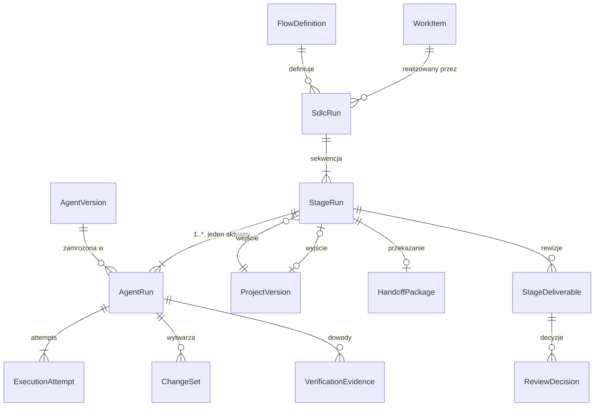

# Helmflow — model danych

Część dokumentacji produktowej Helmflow, wersja zestawu 0.9 (2026-09-06). Indeks: [README](README.md).

Normatywny punkt wyjścia dla implementacji `packages/sdk` — od tej specyfikacji zaczyna się kod ([D9.1](decyzje.md)). Pojęcia biznesowe: [model-domeny](model-domeny.md).

## 1. Zasady budowy modeli

Rozstrzygnięcie „JSON → klasy czy klasyczne OOP": **hybryda — klasy jako źródło schematu**.

| Podejście | Zalety | Wady |
|---|---|---|
| Schema-first (JSON Schema źródłem, klasy generowane) | kontrakt niezależny od języka; wersjonowanie formatu wprost | wygenerowane klasy są anemiczne; codegen przy każdej zmianie; słaba ergonomia w Pythonie |
| Klasyczne OOP (bogate klasy, zachowanie w środku) | niezmienniki blisko danych; enkapsulacja | osobna warstwa serializacji; ryzyko hierarchii dziedziczenia; trudny kontrakt dla TypeScript |
| **Hybryda: klasy jako źródło schematu (przyjęta)** | niemutowalne klasy Pydantic v2 są jednocześnie klasami i JSON-em: walidacja, serializacja i JSON Schema pochodzą z definicji klasy | wymaga dyscypliny — logika procesowa nie może przenikać do modeli |

Reguły (do przypieczętowania ADR-em w kroku 6):

1. **Modele SDK = niemutowalne klasy Pydantic v2** (`frozen=True`). Nie piszemy schematów JSON ręcznie i nie generujemy klas z JSON-a — kierunek jest zawsze: klasy → schemat. Z wygenerowanych schematów powstają w CI typy TypeScript dla frontendu.
2. **Podział odpowiedzialności za niezmienniki**: niezmienniki pojedynczego obiektu egzekwuje model (walidatory, konstruktory); niezmienniki przekrojowe egzekwują przypadki użycia silnika i ograniczenia bazy. Modele nie są anemiczne, ale nie prowadzą procesów.
3. **Bez dziedziczenia pojęć domenowych** — warianty przez unie dyskryminowane, współdzielenie przez kompozycję.
4. **Typowane identyfikatory** jako value objects zamiast gołych stringów — kontrakty przyjmują typy, nie prymitywy.
5. **Przejścia stanów jako jawne operacje zwracające nową instancję** — spójne z niemutowalnością wersji w całej domenie.
6. **Modele ORM żyją wyłącznie w silniku** i są mapowane na modele SDK wewnątrz silnika; SDK nigdy nie widzi SQLAlchemy.

## 2. Identyfikatory i typy wspólne

```python
# Typowane identyfikatory (value objects; wewnętrznie ULID)
ProjectId, RepositoryId, ProjectVersionId, AgentDefinitionId, AgentVersionId,
KnowledgePackId, KnowledgeVersionId, WorkItemId, CriterionId, FlowDefinitionId,
SdlcRunId, StageRunId, AgentRunId, AttemptId, SandboxId, ChangeSetId,
FileVersionId, CheckpointId, EvidenceId, HandoffId, DeliverableId,
ReviewId, DecisionId, EnvironmentId, SnapshotId

GitSha        = str          # 40-znakowy SHA wewnętrznego repozytorium (D4)
ContentHash   = str          # hash zawartości pliku (algorytm w ADR kroku 6)
ArtifactRef   = frozen(store: str, key: str, content_hash: ContentHash, media_type: str)
TrajectoryRef = frozen(agent_run_id: AgentRunId, sequence: int)
Budget        = frozen(max_tokens: int?, max_cost: Decimal?, max_wall_time: timedelta?)
BudgetUsage   = frozen(tokens: int, cost: Decimal, wall_time: timedelta)
```

Zapis: pseudokod deklaracji (bez importów i walidatorów); nazwy pól wiążące, chyba że ADR z kroku 6 postanowi inaczej; pola oznaczone `?` są opcjonalne.

## 3. Projekt i wersje

```python
Project        = frozen(id, name: str, created_at: datetime)

Repository     = frozen(id, project_id, url: str, default_branch: str,
                        base_revision: GitSha)   # utrwalona przy rejestracji

ProjectVersion = frozen(id, project_id,
                        parent_id: ProjectVersionId?,      # None dla wersji bazowej
                        internal_commit: GitSha,           # commit w wewnętrznym bare git
                        artifact_refs: tuple[ArtifactRef, ...],
                        produced_by: AgentRunId?,          # None dla wersji bazowej
                        created_at)
```

## 4. Agenci

```python
RoleName        = str  # np. "Backend Developer"; słownik ról otwarty

AgentDefinition = frozen(id, name: str, role: RoleName, purpose: str, created_at)

AgentScope      = enum(GLOBAL, PROJECT)

AgentVersion    = frozen(id, definition_id, number: int,
                         scope: AgentScope,
                         project_id: ProjectId?,           # wymagane dla PROJECT
                         origin: AgentVersionId?,          # pochodzenie forka/promocji
                         instructions: str,
                         model_profile: ModelProfile,
                         required_knowledge: tuple[KnowledgePackId, ...],
                         policies: PolicySet,
                         published_at)

ModelProfile    = frozen(alias: str, params: Mapping, budget: Budget)  # trasa przez LiteLLM
PolicySet       = frozen(sandbox_policy: SandboxPolicy, loop_limit: int = 2)
SandboxPolicy   = frozen(cpu, memory, pids, disk, wall_time,
                         egress_allowlist: tuple[str, ...])  # rejestry pakietów per projekt (D7.4)
```

## 5. Wiedza

```python
KnowledgeScope    = enum(GLOBAL, PROJECT, REPOSITORY, ROLE, STAGE, WORK_ITEM)

KnowledgePack     = frozen(id, name: str, scope: KnowledgeScope, project_id: ProjectId?)

KnowledgeVersion  = frozen(id, pack_id, number: int, content: ArtifactRef, published_at)

ManifestEntry     = frozen(pack_id, version_id, order: int, origin: str)

KnowledgeManifest = frozen(agent_run_id, entries: tuple[ManifestEntry, ...])  # deterministyczna kolejność
```

## 6. Praca i SDLC

```python
AcceptanceCriterion = frozen(id, text: str, verification_hint: str?)

WorkItemStatus  = enum(OPEN, IN_PROGRESS, DONE, CANCELLED)
WorkItem        = frozen(id, project_id, title: str, goal: str,
                         constraints: str?, criteria: tuple[AcceptanceCriterion, ...],
                         status: WorkItemStatus)

StageKind       = enum(ANALYSIS, ARCHITECTURE, IMPLEMENTATION, TESTS, REVIEW, CUSTOM)
StageSpec       = frozen(key: str, kind: StageKind,
                         expected_artifacts: tuple[str, ...],
                         human_gate: bool,
                         agent_selector: AgentVersionId | RoleName)

FlowDefinition  = frozen(id, name: str, stages: tuple[StageSpec, ...], max_returns: int = 2)

SdlcRunStatus   = enum(CREATED, RUNNING, AWAITING_REVIEW, COMPLETED, REJECTED, CANCELLED, FAILED)
SdlcRun         = frozen(id, work_item_id, flow_id, base_version_id: ProjectVersionId,
                         status: SdlcRunStatus, budget: Budget, usage: BudgetUsage,
                         returns_used: int)

StageRunStatus  = enum(PENDING, RUNNING, BLOCKED, AWAITING_GATE, COMPLETED, FAILED, SUPERSEDED)
StageRun        = frozen(id, sdlc_run_id, stage_key: str, sequence: int,
                         status: StageRunStatus,
                         input_version_id: ProjectVersionId,
                         output_version_id: ProjectVersionId?)
# Stage Run ma 1..* Agent Runs (ponowne przydzielenie po awarii tworzy kolejny),
# co najwyżej jeden aktywny — niezmiennik 30.
```

## 7. Wykonanie

```python
AgentRunStatus   = enum(CREATED, PROVISIONING, RUNNING, BLOCKED, STOPPING, STOPPED,
                        FINISHED, FAILED, CANCELLED)
AgentRun         = frozen(id, stage_run_id, agent_version_id,
                          knowledge_manifest: KnowledgeManifest,
                          runtime_profile: RuntimeProfile, model_profile: ModelProfile,
                          input_version_id: ProjectVersionId,
                          status: AgentRunStatus, usage: BudgetUsage)

RuntimeProfile   = frozen(dsh_version: str, runner_image_digest: str,
                          plugin_set: tuple[str, ...])

ExecutionAttempt = frozen(id, agent_run_id, number: int, dsh_session_id: str,
                          sandbox_id: SandboxId, started_at, ended_at: datetime?,
                          outcome: enum(FINISHED, INTERRUPTED, FAILED)?)

BlockedQuestion  = frozen(agent_run_id, asked_at, question: str,
                          answer: str?, answered_at: datetime?)   # ślad audytowy D6.2
```

## 8. Zmiany i dowody

```python
FileChangeKind   = enum(CREATED, MODIFIED, DELETED, RENAMED, BINARY_CHANGED)
FileChangeEvent  = frozen(id: str, agent_run_id, path: str, kind: FileChangeKind,
                          observed_at, correlated: TrajectoryRef?)   # telemetria (D6.5)

FileVersion      = frozen(id, path: str, content_hash: ContentHash, size: int,
                          checkpoint_id: CheckpointId?, version_id: ProjectVersionId?)

CheckpointReason = enum(START, LOGICAL_STAGE, POST_TESTS, FINAL, MANUAL)
Checkpoint       = frozen(id, agent_run_id, reason: CheckpointReason,
                          tree_hash: GitSha, created_at)

ChangeRationale  = frozen(intent: str, reason: str, criterion_id: CriterionId?,
                          verification: str, risk: str)

ChangeSetStatus  = enum(CURRENT, MODIFIED_LATER, SUPERSEDED, REVERTED, PARTIAL)
ChangeSet        = frozen(id, agent_run_id, rationale: ChangeRationale,
                          paths: tuple[str, ...],
                          trajectory_refs: tuple[TrajectoryRef, ...],
                          status: ChangeSetStatus)

EvidenceKind     = enum(TEST, BUILD, LINT, COMMAND, ANALYSIS_REFERENCE)
EvidenceSource   = enum(PLATFORM_OBSERVED, AGENT_CLAIM)
AnalysisRef      = frozen(path: str, line: int?, method: str)       # dowód analityczny (D8.1)
VerificationEvidence = frozen(id, agent_run_id, kind: EvidenceKind,
                              source: EvidenceSource,
                              result: enum(PASSED, FAILED, OBSERVED),
                              target: str, analysis_ref: AnalysisRef?,
                              details: ArtifactRef?)
```

## 9. Handoff, rezultaty, review

```python
CriterionStatus  = enum(MET, OPEN, NOT_APPLICABLE)

HandoffPackage   = frozen(id, stage_run_id,
                          input_version_id, output_version_id: ProjectVersionId,
                          artifacts: tuple[ArtifactRef, ...],
                          decisions: tuple[str, ...],
                          criteria: tuple[(CriterionId, CriterionStatus), ...],
                          risks: tuple[str, ...],
                          open_questions: tuple[str, ...],
                          degraded: bool)                            # fallback D6.4

StageDeliverable = frozen(id, stage_run_id, revision: int,
                          diff: ArtifactRef, change_sets: tuple[ChangeSetId, ...],
                          evidence_map: tuple[(CriterionId, EvidenceId), ...],
                          risks: tuple[str, ...], consistent: bool)  # znacznik rekonsyliacji

ProjectDeliverable = frozen(id, sdlc_run_id, revision: int,
                            global_diff: ArtifactRef,
                            version_chain: tuple[ProjectVersionId, ...],
                            handoffs: tuple[HandoffId, ...],
                            evidence_map: tuple[(CriterionId, EvidenceId), ...],
                            risks: tuple[str, ...])

DecisionType     = enum(APPROVE, REQUEST_CHANGES, REJECT)
ReviewDecision   = frozen(id, deliverable_id: DeliverableId, decision: DecisionType,
                          justification: str,                        # wymagane dla RC/REJECT
                          return_to_stage: str?,                     # klucz etapu dla REQUEST_CHANGES
                          decided_by: str, decided_at: datetime)
```

## 10. Środowiska (kontrakt w MVP, implementacja po MVP — D8.3)

```python
EnvironmentStatus   = enum(DEFINED, PROVISIONING, READY, SUSPENDED, DESTROYED)
ManagedEnvironment  = frozen(id, project_id, name: str, spec: Mapping,
                             status: EnvironmentStatus)
EnvironmentSnapshot = frozen(id, environment_id, label: str?, created_at)
```

## 11. Relacje rdzenia wykonania



## 12. Mapowanie encji na magazyny

| Encja | PostgreSQL | Wewnętrzny git | Storage artefaktów |
|---|---|---|---|
| Project, Repository, WorkItem, FlowDefinition, SdlcRun, StageRun, AgentRun, ExecutionAttempt, BlockedQuestion | rekord | — | — |
| AgentDefinition, AgentVersion, KnowledgePack | rekord | — | — |
| KnowledgeVersion | metadane | — | treść (`content`) |
| ProjectVersion | manifest (metadane, parent, produced_by) | drzewo kodu i artefaktów plikowych (`internal_commit`) | artefakty wielkogabarytowe (`artifact_refs`) |
| FileChangeEvent | rekord (telemetria) | — | — |
| FileVersion, Checkpoint | metadane | zawartość (`tree_hash`, obiekty) | — |
| ChangeSet, ChangeRationale | rekord | — | — |
| VerificationEvidence | rekord | — | szczegóły (`details`) |
| HandoffPackage, StageDeliverable, ProjectDeliverable, ReviewDecision | rekord | — | diffy i załączniki (`ArtifactRef`) |
| Trajectory (surowe JSONL) | indeks/ingest | — | log źródłowy |
| ManagedEnvironment, EnvironmentSnapshot | rekord | — | obrazy/snapshoty (po MVP) |

Spójność między trzema magazynami przy backupie i restore: [produkt, rozdz. 6](produkt.md).

## 13. Rozstrzygnięcia wymuszone przez modelowanie

Specyfikacja domknęła trzy kwestie, których proza nie rozstrzygała; są wiążące jak reszta dokumentacji:

1. **Stage Run ↔ Agent Run: 1 do wielu** — ponowne przydzielenie po awarii tworzy kolejny Agent Run w tym samym Stage Run (co najwyżej jeden aktywny); Request Changes tworzy nowy Stage Run. Zapisane jako niezmiennik 30 w [modelu domeny](model-domeny.md).
2. **Project Version niesie `parent_id` i `produced_by`** — łańcuch wersji i atrybucja per agent mają oparcie w danych, nie tylko w opisie.
3. **Dowód ma jawne pochodzenie** (`EvidenceSource`: zaobserwowany przez platformę / deklaracja agenta) i osobny rodzaj dla przepływu zrozumienia (`ANALYSIS_REFERENCE` z polami plik/linia/metoda — [D8.1](decyzje.md)).
