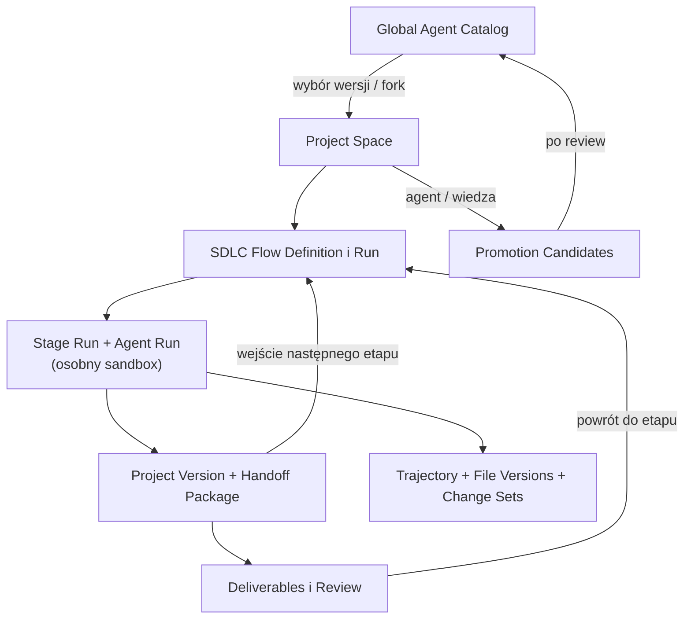

# Helmflow — model domeny

Część dokumentacji produktowej Helmflow, wersja zestawu 0.9 (2026-09-06). Indeks: [README](README.md).

Model opisuje pojęcia biznesowe; nie przesądza tabel, dokumentów ani zdarzeń. Odpowiedzialności warstw: [architektura](architektura.md). Przepływy operujące na tych pojęciach: [przeplywy](przeplywy.md). Techniczna specyfikacja klas: [model-danych](model-danych.md).

## 1. Katalog agentów

| Pojęcie | Definicja |
|---|---|
| **Global Agent Catalog** | Pula agentów wielokrotnego użytku, niezależna od projektów. |
| **Agent Definition** | Trwała tożsamość i przeznaczenie agenta (np. Backend Developer). |
| **Global Agent Version** | Niezmienna, opublikowana wersja zachowania, instrukcji, kompetencji i polityk agenta. |
| **Project Agent Version** | Projektowa wersja wyprowadzona z globalnej (fork) albo utworzona lokalnie; zachowuje pochodzenie; nie modyfikuje wersji globalnej. |
| **Agent Promotion Candidate** | Kontrolowana propozycja nowej wersji globalnej na bazie wersji projektowej; wymaga oddzielenia wiedzy ogólnej od projektowej, redakcji danych poufnych i review człowieka; nie aktualizuje automatycznie istniejących projektów. |
| **Role** | Wzorzec odpowiedzialności (nie jest uruchamialnym agentem). |

## 2. Projekt i wersje

| Pojęcie | Definicja |
|---|---|
| **Project** | Trwała tożsamość przedsięwzięcia. |
| **Project Space** | Granica przechowywania kodu, wiedzy, agentów projektowych, procesów, wersji, artefaktów i audytu. Nie jest współdzielonym katalogiem roboczym. |
| **Repository** | Zewnętrzne źródło kodu (bazowa rewizja) i cel integracji. Jedno repozytorium na projekt w MVP. |
| **Project Version** | Niezmienny, przekazywalny stan projektu (kod + artefakty), implementowany zgodnie z [D4](decyzje.md). Wejście i wyjście etapów. |

## 3. Wiedza

| Pojęcie | Definicja |
|---|---|
| **Knowledge Pack** | Tematycznie spójny zestaw wiedzy (globalnej, projektowej, repozytoryjnej, roli, etapu, Work Item). |
| **Knowledge Version** | Niezmienna wersja paczki wiedzy. |
| **Knowledge Manifest** | Zamknięty zestaw konkretnych wersji wiedzy przekazany jednemu Agent Run; deterministyczna kolejność składania; zapisane pochodzenie każdego fragmentu. |
| **Knowledge Promotion Candidate** | Wiedza projektowa zgłoszona do uogólnienia; wymaga redakcji i review przed wejściem do puli globalnej. |

## 4. Praca i SDLC

| Pojęcie | Definicja |
|---|---|
| **Work Item** | Cel biznesowy lub techniczny prowadzony przez flow; Task to najprostszy rodzaj. |
| **Acceptance Criterion** | Obserwowalny warunek odbioru rezultatu. |
| **SDLC Flow Definition** | Wielokrotnego użytku definicja etapów, zależności, bramek i limitów pętli ([D6.1](decyzje.md)). |
| **Stage** | Definicja jednego etapu: cel, wymagane wejście, oczekiwane artefakty, kryterium wyboru agenta, kryteria ukończenia, polityka przejścia, ewentualna bramka człowieka. |
| **SDLC Run** | Wykonanie flow dla Work Item od bazowej Project Version. |
| **Stage Run** | Wykonanie jednego etapu w ramach SDLC Run. |
| **Agent Assignment** | Wybór konkretnej wersji agenta (globalnej lub projektowej) dla Stage Run. |
| **Handoff Package** | Formalne wyjście etapu: wskazanie wejściowej Project Version, artefakty, decyzje, kryteria spełnione/otwarte, ryzyka, pytania dla następnego agenta, odnośniki do trajectory i Change Sets. Przekazuje rezultat, nigdy środowisko. Schemat walidowany, z fallbackiem ([D6.4](decyzje.md)). |

## 5. Wykonanie

| Pojęcie | Definicja |
|---|---|
| **Agent Run** | Logiczna historia pracy jednego agenta w jednym Stage Run. |
| **Execution Attempt** | Pojedyncze uruchomienie procesu DSH w obrębie Agent Run; resume tworzy kolejny attempt bez zmiany tożsamości Agent Run. |
| **Runtime Profile** | Przypięta wersja DSH + kompozycja pluginów. |
| **Model Profile** | Kontrolowana trasa do modelu (LiteLLM → MiniMax), parametry, limity i budżety ([D6.1](decyzje.md)). |
| **Sandbox Policy / Sandbox** | Reguły i środowisko izolacji jednego Agent Run: zasoby, sieć, narzędzia, retencja. |
| **Workspace** | Kopia wejściowej Project Version w sandboxie; nie jest źródłem prawdy. |
| **Harness Home** | Izolowany stan DSH danego Agent Run. |
| **Agent Trajectory** | Append-only historia działania DSH jednego Agent Run, eksportowana poza sandbox. |
| **Managed Environment** | Izolowane, długożyjące środowisko projektu (maszyna wirtualna z zainstalowaną platformą), przypisywalne do etapów; agent operuje na nim wyłącznie przez Environment Controller ([D8.3](decyzje.md)). |
| **Environment Snapshot** | Utrwalony stan Managed Environment umożliwiający odtworzenie i porównanie; odpowiednik checkpointu dla środowiska. |

## 6. Zmiany i dowody

| Pojęcie | Definicja |
|---|---|
| **File Change Event** | Zaobserwowana zmiana pliku w czasie (utworzenie/modyfikacja/usunięcie/rename/binarna), rejestrowana przez niezależny tracker, korelowana z trajectory. Telemetria ([D6.5](decyzje.md)). |
| **File Version** | Utrwalony stan pliku przy checkpointcie lub Project Version. |
| **Change Set** | Logiczna grupa zmian jednego zamiaru; należy do dokładnie jednego Agent Run; zawiera jawną intencję, powód, kryterium, weryfikację i ryzyko (nie surowy reasoning). |
| **Change Rationale** | Ustrukturyzowany opis Change Setu przygotowany przez agenta narzędziem platformy (schemat walidowany w SDK): intencja, powód, realizowane kryterium, sposób weryfikacji, ryzyko. Nie jest surowym rozumowaniem modelu. |
| **Checkpoint** | Odtwarzalny stan workspace'u w czasie Agent Run; niezależny od `.git` w sandboxie. |
| **Verification Evidence** | Zaobserwowany przez platformę dowód testu/kompilacji/analizy; odróżniany od deklaracji agenta. |

## 7. Rezultaty i nadzór

| Pojęcie | Definicja |
|---|---|
| **Stage Deliverable** | Rezultat jednego Stage Run: diff agenta i etapu, Change Sets, mapowanie kryteriów na dowody, ryzyka. Niemodyfikowalny; poprawki tworzą kolejną rewizję. |
| **Project Deliverable** | Rezultat całego SDLC Run: Global Project Diff, łańcuch Project Versions i Handoffów, dowody wszystkich etapów. |
| **Review / Review Decision** | Ocena Deliverable; decyzje Approve / Request Changes / Reject; decyzja należy do człowieka (Reviewer Agent tylko doradza). |
| **Reviewer Agent** | Agent etapu review: wykonuje przegląd rezultatu i wytwarza raport-rekomendację jako Stage Deliverable swojego etapu. Materiał doradczy — nie podejmuje Review Decision (niezmiennik 20). |
| **Integration** | Zastosowanie zaakceptowanej Project Version w repozytorium docelowym (patch/commit/branch/PR). Osobny fakt od akceptacji. |

## 8. Relacje

## 9. Niezmienniki domenowe

1. Agent Definition istnieje niezależnie od projektu.
2. Projekt zawsze używa konkretnej, niezmiennej wersji agenta.
3. Project Agent Version nie zmienia wersji globalnej, z której powstała.
4. Promocja projektowej wersji tworzy nową wersję globalną i wymaga review.
5. Istniejące projekty nie aktualizują agentów automatycznie po promocji.
6. SDLC Run posiada bazową Project Version i realizuje jeden Work Item.
7. Stage Run należy do jednego SDLC Run.
8. Agent Run wykonuje jeden agent w ramach jednego Stage Run.
9. Każdy Agent Run posiada własny sandbox, workspace i Harness home.
10. Następny agent nie otrzymuje sandboxa poprzednika.
11. Dane przechodzą między agentami wyłącznie przez Project Version, artefakty i Handoff Package.
12. Resume może ponownie użyć stanu wyłącznie tego samego Agent Run.
13. Trajectory DSH jest przechowywane osobno dla każdego Agent Run.
14. Historia zmian plików jest rejestrowana niezależnie od trajectory.
15. Każdy Change Set należy do jednego Agent Run.
16. Global Project Diff może obejmować wiele agentów i etapów.
17. Zmiana później zastąpiona pozostaje w historii z autorem i czasem wykonania.
18. Git blame nie jest źródłem domenowej atrybucji agentów.
19. Stage Deliverable nie jest automatycznie akceptowany, jeśli etap posiada bramkę człowieka.
20. Reviewer Agent może doradzać, ale nie zastępuje wymaganej decyzji człowieka.
21. Approved nie oznacza automatycznie Integrated.
22. Usunięcie sandboxa nie może usunąć trajectory, Change Setów, File Versions ani zaakceptowanych artefaktów.
23. Wiedza albo agent utworzone w projekcie nie trafiają do globalnej puli bez kontrolowanej promocji.
24. SDLC Run ma w danym momencie co najwyżej jeden aktywny Stage Run ([D6.6](decyzje.md)).
25. File Change Events są telemetrią; prawdę o zmianach ustala rekonsyliacja wersji wejściowej i wyjściowej ([D6.5](decyzje.md)).
26. Powroty flow do wcześniejszego etapu podlegają limitowi z Flow Definition; przekroczenie eskaluje do człowieka ([D6.1](decyzje.md)).
27. Agent Run w stanie Blocked czeka na jawną odpowiedź człowieka; odpowiedź staje się częścią kontekstu i śladu audytowego ([D6.2](decyzje.md)); powiadomienie o stanie Blocked jest widoczne w TUI, także przy jego następnym otwarciu — dodatkowe kanały po MVP.
28. Stage Deliverable bez poprawnego handoffu agenta otrzymuje handoff zastępczy i jest oznaczony jako zdegradowany ([D6.4](decyzje.md)).
29. Agent operuje na Managed Environments wyłącznie przez Environment Controller; środowiska są odizolowane od hosta i od sandboxów ([D8.3](decyzje.md)).
30. Stage Run może mieć wiele Agent Runs (ponowne przydzielenie po awarii tworzy kolejny), ale w danym momencie co najwyżej jeden aktywny; wcześniejsze zachowują pełną historię ([model-danych, A.11](model-danych.md)).

## 10. Przykład: jeden SDLC Run na pojęciach modelu

Właściciel ma w Project Space projekt z zarejestrowanym Repository i bazową **Project Version PV0** (utrwalona rewizja gałęzi głównej). Tworzy **Work Item** „dodaj limit prób logowania" z dwoma **Acceptance Criteria** (limit działa; testy przechodzą) i wybiera **SDLC Flow Definition** implementacja → testy → review, z bramką człowieka na końcu i limitem powrotów 2.

Uruchomienie tworzy **SDLC Run** na bazie PV0. Powstaje pierwszy **Stage Run** (implementacja) z **Agent Assignment** wskazującym Project Agent Version „Backend Developer / v2". Silnik tworzy **Agent Run**: zamraża wersję agenta, **Knowledge Manifest** (konkretne Knowledge Versions), Runtime Profile i Model Profile, po czym pierwszy **Execution Attempt** rusza w świeżym **sandboxie** z **workspace'em** (kopią PV0) i własnym **Harness home**. DSH zapisuje **Agent Trajectory**; **Workspace Tracker** rejestruje **File Change Events**; agent zgłasza **Change Set** z **Change Rationale** („dodaję licznik prób — kryterium 1") i **Verification Evidence** (uruchomione testy, źródło: platforma). Przy checkpointach utrwalane są **File Versions**.

Agent kończy: silnik wykonuje rekonsyliację workspace'u, publikuje **PV1** (parent: PV0, produced_by: ten Agent Run), a agent zostawia **Handoff Package** (decyzje, ryzyka, otwarte pytania). Sandbox znika — historia nie ([niezmiennik 22](#9-niezmienniki-domenowe)).

Drugi Stage Run (testy) dostaje **nowy** sandbox z kopią PV1 — nigdy środowisko poprzednika (niezmiennik 10). Test Agent znajduje błąd brzegowy: jego **Stage Deliverable** zawiera dowód FAILED. Flow wraca do implementacji (powrót 1 z 2): powstaje **nowy Stage Run** implementacji z nowym Agent Run na bazie PV1 + uwag z testów. Poprawka daje PV2, ponowne testy przechodzą, Reviewer Agent produkuje raport-rekomendację, a właściciel na bramce podejmuje **Review Decision: Approve**. Powstaje **Project Deliverable** (Global Project Diff PV0→PV2, łańcuch handoffów, mapa kryteria→dowody). **Integration** eksportuje patch do Repository — osobny krok po akceptacji (niezmiennik 21). Sprawdzone w praktyce instrukcje testowe agent zgłasza jako **Knowledge Candidate**; po review właściciela staną się wiedzą repozytorium dla kolejnych runów.
