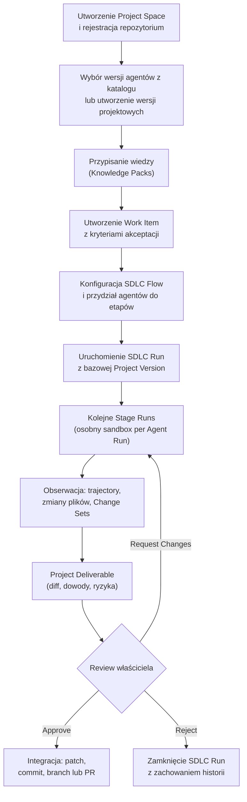
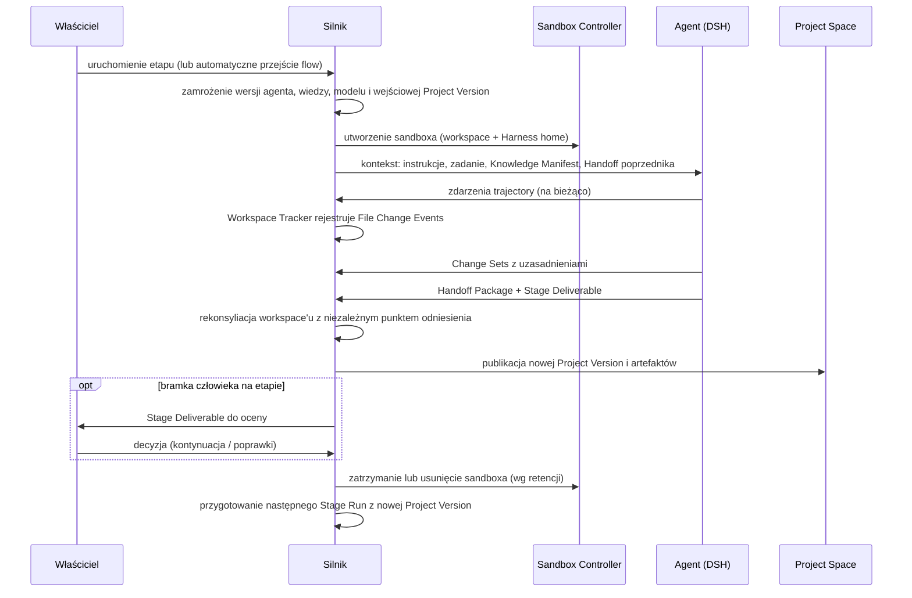
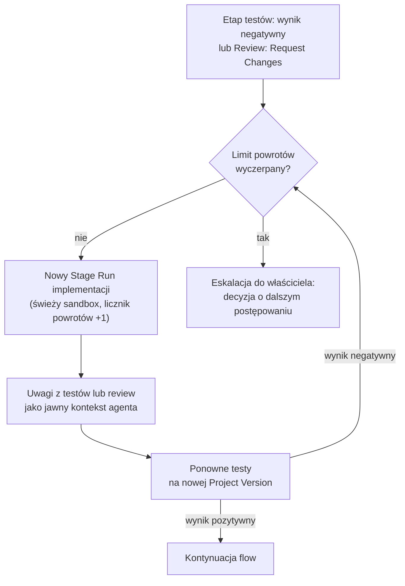
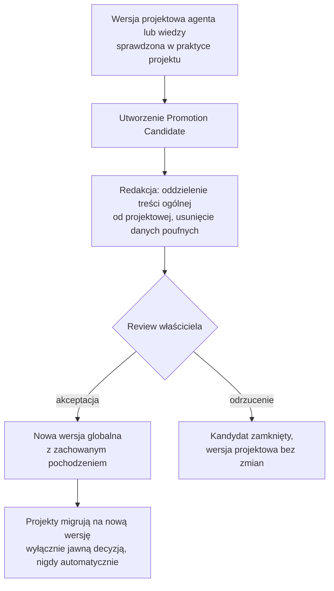
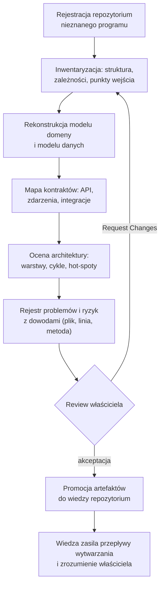

# Helmflow — przepływy użytkownika i diagramy użycia

Część dokumentacji produktowej Helmflow, wersja zestawu 0.9 (2026-09-06). Indeks: [README](README.md).

Przepływy opisują przypadki użycia niezależnie od interfejsu — realizuje je wspólny kontrakt Engine. Pierwszym interfejsem jest CLI/TUI ([D9.3](decyzje.md)); Web realizuje te same przepływy później. Widoki interfejsów: [cli](cli.md), [platforma-web](platforma-web.md).

## 1. Aktorzy i przypadki użycia

| Aktor | Przypadki użycia |
|---|---|
| **Właściciel** (Engineering Manager / Tech Lead) | zarządzanie katalogiem agentów i wersjami projektowymi; zarządzanie wiedzą; definiowanie Work Item, kryteriów i SDLC Flow; uruchamianie i kontrola SDLC Run (stop, cancel, resume); obserwacja trajectory i zmian; odpowiadanie na pytania agentów (Blocked); review i decyzje (Approve / Request Changes / Reject); integracja rezultatu; promocja agentów i wiedzy |
| **Agent wykonawczy** (przez DSH, w sandboxie) | wykonanie etapu na wejściowej Project Version; raportowanie Change Rationale; tworzenie Handoff Package; zgłoszenie Stage Deliverable; zadanie pytania właścicielowi (Blocked) |
| **Silnik** (automatyka) | zamrażanie konfiguracji; tworzenie i sprzątanie sandboxów; śledzenie zmian i rekonsyliacja; egzekwowanie budżetów, limitów pętli i bramek; publikacja Project Versions |

## 2. Przepływ główny (happy path)



## 3. Sekwencja pojedynczego Stage Run



## 4. Pętla poprawek



## 5. Pytanie agenta do właściciela (stan Blocked)

```mermaid
sequenceDiagram
    participant AG as Agent (DSH)
    participant S as Silnik
    participant W as Właściciel

    AG->>S: pytanie wymagające decyzji człowieka
    S->>S: Agent Run przechodzi w stan Blocked
    S->>W: powiadomienie z treścią pytania i kontekstem
    W->>S: odpowiedź (decyzja)
    S->>AG: odpowiedź jako jawny kontekst; wznowienie tego samego Agent Run
    Note over S: pytanie i odpowiedź trafiają do śladu audytowego
```

## 6. Promocja wersji projektowej do puli globalnej



## 7. Przepływ zrozumienia programu



Zasady przepływu zrozumienia:

- każdy etap wytwarza artefakty analityczne zamiast zmian kodu; Project Version niesie je jak każdy inny artefakt,
- dowodem twierdzenia analitycznego jest odnośnik do kodu (plik, linia) wraz z metodą ustalenia ([D8.1](decyzje.md)); twierdzenia bez dowodu są oznaczane jako deklaracje agenta,
- weryfikacja hipotez o działaniu programu może wymagać jego uruchomienia — w MVP w sandboxie Agent Run, po MVP także w Managed Environments ([D8.3](decyzje.md)),
- zatwierdzone artefakty przechodzą przepływ promocji wiedzy (rozdział 6) i stają się wiedzą repozytorium dla przepływów wytwarzania.
